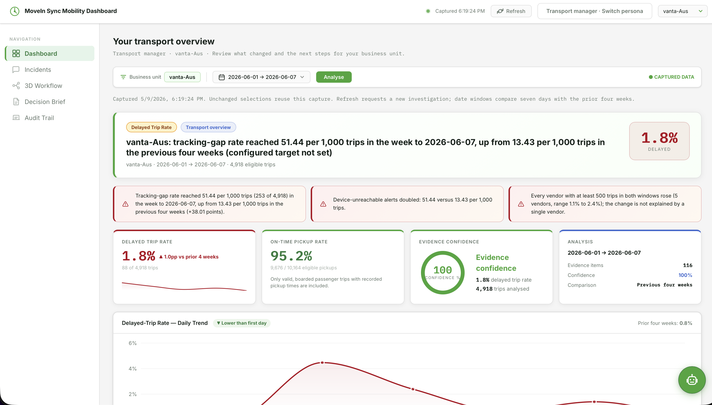
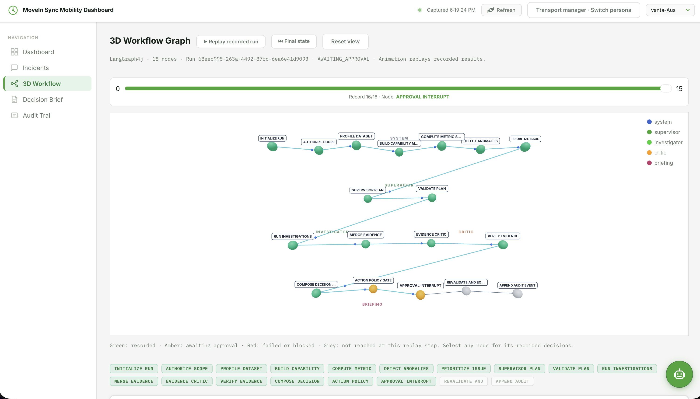
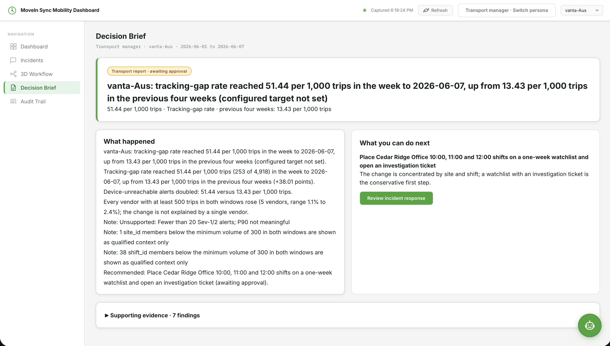
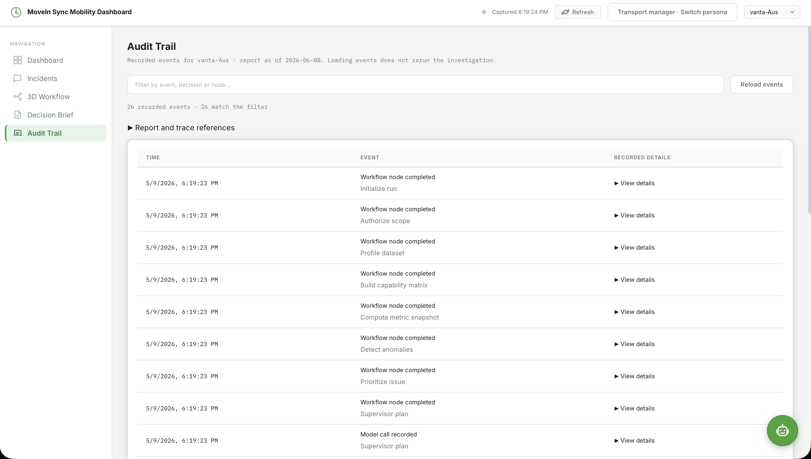
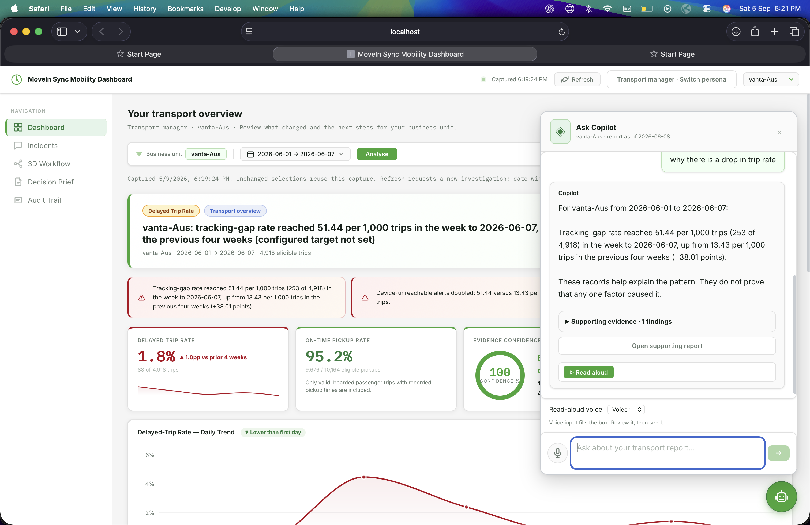

# Mobility Decision Copilot

A Java 21 / Spring Boot and React / TypeScript agentic intelligence platform built for the MoveInSync AI Hackathon challenge.

The checked-in product is an evidence-governed multi-agent decision platform:

`request -> tenant/RBAC -> DuckDB metrics -> anomaly detection -> four agent roles -> evidence critic -> dual brief -> approval -> revalidation -> idempotent mock effect -> audit/trace`

---

## 🖼️ User Interface & Screenshots

### 1. Executive & Operational Dashboard

*Real-time tenant-isolated transport dashboard displaying governed DuckDB metric cards (M01-M18), delay spikes, punctuality trends, and fleet distribution.*

### 2. 3D Multi-Agent Workflow DAG

*Interactive 3D graph visualizer powered by LangGraph4j, tracking state transitions across Supervisor, Investigator, Evidence Critic, and Briefing agents.*

### 3. Dual Brief & Human-in-the-Loop Decision Approval

*Governed decision proposal with multi-audience briefing (Operations vs Executive), risk rationale, policy citations, and idempotent action approval controls.*

### 4. Governed Audit Trail & Telemetry

*Immutable audit trail and trace logger capturing every tenant access, RBAC check, DuckDB SQL execution, agent state transition, and approval.*

### 5. Supervisor Voice & Chat Copilot (Sarvam AI Integration)

*Multi-modal copilot floating widget featuring Speech-to-Text input, Sarvam AI `bulbul:v3` Text-to-Speech synthesis (MP3), persona voice dropdown (Shubh, Ritu, Rahul, Arvind, Meera), real-time network latency loader, and structured evidence pills.*

---

## 🚀 Prerequisites

- JDK 21
- Maven 3.9+
- Node.js 22+
- Docker (optional)

## ⚡ Run with the tiny fixture

```bash
./mvnw -pl backend spring-boot:run
npm install
npm run dev
```

Open `http://localhost:5173`. The Vite development server proxies `/api` to Spring Boot on port 8080.

The default dataset is `data/fixtures`. To use the official anonymized trip-log dataset:

```bash
export MOBILITY_DATA_DIR="$PWD/outputs/official dataset/MoveInSync - Anonymised Trip-Log Dataset"
./mvnw -pl backend spring-boot:run
```

The product endpoint is:

```bash
curl -H 'X-Business-Unit: pinnacle-Slc' \
  'http://localhost:8080/api/v1/briefs/morning?asOf=2026-06-08'
```

The default runtime uses governed DuckDB analytics, the 18-node LangGraph4j workflow,
registry-backed tenant/RBAC checks, the in-memory local control plane and an in-memory trace
exporter. No external secret is required for the local demo.

## 🎙️ Sarvam AI Voice Integration & Options

- **Sarvam AI `bulbul:v3` Model**: High-quality Indian English speech synthesis with `mp3` audio codec.
- Set `VITE_SARVAM_API_KEY` and `VITE_USE_SARVAM_TTS=true` in `frontend/.env` (or `SARVAM_API_KEY` in the root environment).
- Features persona voice profiles (`assistant` ➔ Shubh, `manager` ➔ Ritu, `expert` ➔ Rahul, `executive` ➔ Arvind, `analyst` ➔ Meera) with instant switching during active audio playback and network latency loading indicators.

## ⚙️ Optional profiles

- `-Pai-openai`: adds the Spring AI OpenAI model starter. Set `OPENAI_API_KEY` before activating it.
- `-Ppostgres`: adds PostgreSQL/Flyway dependencies. Run with Spring profile `postgres`.
- LangGraph4j owns graph execution and approval interruption (D-046).
- Set `LANGUAGE_MODEL=sarvam` and `SARVAM_API_KEY` in the backend terminal to enable Sarvam. See [setup guide](docs/try1-setup.md).
- Langfuse export is optional. Set `LANGFUSE_HOST`, `LANGFUSE_PUBLIC_KEY` and `LANGFUSE_SECRET_KEY`.

## 🧪 Release verification

```bash
./scripts/release/verify-release.sh
```

This checks organizer-file integrity, all Java and React tests, official metric reconciliation,
the running product API, approval/resume, tenant isolation, adversarial requests, G1/G2/G3 and the
generated scorecard.

## 📁 Important paths

- `docs/screenshots/` — Product UI screenshots (Dashboard, Workflow, Decision, Audit, Copilot)
- `docs/project-structure.md` — folder ownership and boundary rules
- `backend/src/main/resources/sql/metrics/` — governed metric SQL
- `backend/src/main/resources/prompts/v1/` — versioned agent prompts
- `contracts/` — public API and JSON schemas
- `evals/` — golden and adversarial cases
- `data/fixtures/` — tiny synthetic inputs only

Never modify the files under `outputs/official dataset/`.
