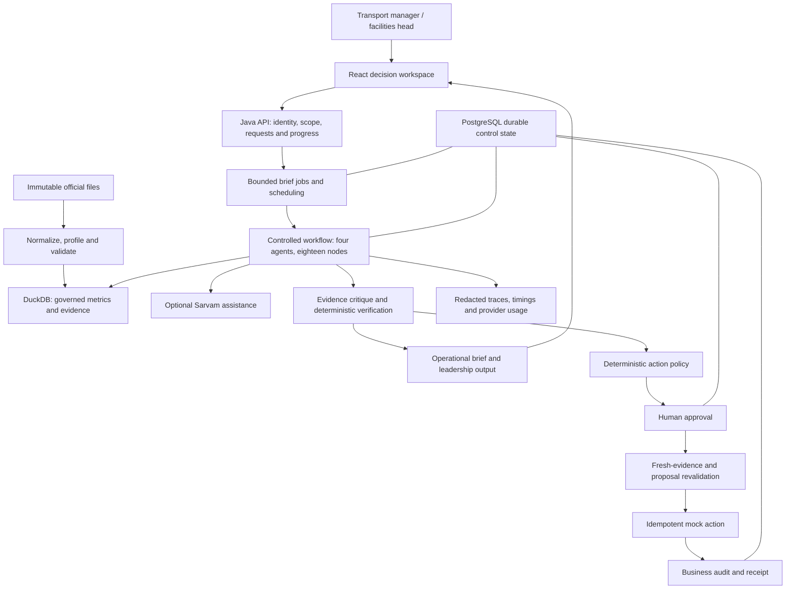

# Mobility Decision Copilot — selected architecture

Version 1.2 · 2026-09-05 · Selected design and Java scaffold

This is the agreed design for a separate team build. It describes responsibilities and acceptance boundaries; it does not claim that a new build is already implemented or benchmarked.

Companion: [requirements and acceptance](requirement.md). Distribution guide: [Understanding the problem statement](<Understanding the problem statement.md>).

## 1. Architecture choice and reason

Build one Java 21/Spring Boot backend and one React/TypeScript application. Use an explicit Java state machine for four logical agents, DuckDB for governed analytics, PostgreSQL for durable shared control state, and an optional server-side Sarvam provider boundary.

This is the best fit for the current problem and supplied batch dataset: it supports proactive investigation and controlled action, preserves accepted metric semantics, limits deployment and model overhead, and allows the team to work through stable component contracts. It is a scope and delivery choice, not a claim that these technologies outperform every alternative.

| Decision | Selected option | Reason and reconsideration condition |
|---|---|---|
| Backend deployment | Modular monolith | One local deployment with clear component ownership. Extract a service only after measured independent load or isolation needs justify it. |
| Frontend | React/TypeScript | Accepted team choice; the statement's Angular preference is not a restriction. Reconsider only for a mandatory starter or changed team constraints. |
| Orchestration | Explicit Java state machine | Visible transitions, bounded investigation and deterministic approval. A graph-library adapter needs a routing, concurrency, state and resume validation gate first. |
| Runtime AI roles | Four, with seven reusable analytical workers | Agent count follows decision responsibilities, not team size. Preserve the explicit Evidence Critic. |
| Analytical facts | DuckDB and M01–M18 v1.1 | The current structured batch dataset needs governed scans and aggregates. PostgreSQL analytics is an alternative only after workload evidence and a migration decision. |
| Durable control state | PostgreSQL | Jobs, checkpoints, approval decisions, duplicate prevention and business audit need shared transactional state. Explicit in-memory mode is only a local fallback. |
| Model provider | Replaceable server-side Sarvam adapter | Bounded plans and explanations over compact evidence. Spring AI is optional; no mandatory framework migration is needed. |
| Document retrieval | Disabled initially | No decision-relevant unstructured corpus has been supplied. Enable only after document, authorization, citation and evaluation gates pass. |
| Monitoring experience | Prioritized exceptions and proactive briefs | Directly serves manager decisions. Replay is optional presentation after the complete batch path works. |

## 2. System responsibilities



The browser never calculates governed facts, reads source CSVs, calls the provider or executes actions. Model output cannot authorize a tenant, change a metric, grant a tool or determine an action state.

## 3. Agents and analytical workers

| Agent | Plain-English job | Boundary |
|---|---|---|
| Supervisor / Planner | Decide which allowed investigations can explain a prioritized issue. | Optional LLM selects among allowlisted workers using bounded untrusted question/context; deterministic validation preserves required comparisons and checks scope, tools and capabilities. |
| Investigator | Choose and run the smallest useful set of governed analyses. | Tools calculate facts; the model cannot generate arbitrary SQL or inspect unrestricted records. |
| Evidence Critic | Challenge claims, comparisons, missing-data caveats and unsupported blame. | Deterministic verification checks the cited values, populations, units, dates and versions. |
| Briefing / Action | Explain verified findings for operations and leadership and draft a bounded recommendation. | Deterministic rendering preserves facts; policy, approval, revalidation and execution remain separate. |

Seven workers serve these roles: vendor; site/shift/direction; delay reason; cost/billing; feedback; tracking/safety alerts; and no-show/roster. They are governed tools using one investigation pattern, not seven extra permanent agents.

Each investigation follows four stages: choose analysis → run the tool → validate its result → decide whether more evidence is needed within budget.

All four roles have a useful deterministic fallback. Reporting templates and policy decisions do not require an additional LLM agent.

## 4. Main workflow

| Node | Responsibility |
|---|---|
| 1. Start run | Create request, actor, scope, version and budget context. |
| 2. Authorize scope | Validate the requested business unit and operation against server identity. |
| 3. Profile dataset | Obtain the validated profile for this data version. |
| 4. Build capabilities | Enable or disable analyses with explicit per-tenant reasons. |
| 5. Compute metric snapshot | Obtain governed current and reference facts. |
| 6. Detect anomalies | Apply approved deterministic comparisons and exclusions. |
| 7. Prioritize issue | Rank eligible issues with explainable, governed impact features. |
| 8. Supervisor plan | Select useful worker tasks and preserve essential comparisons. |
| 9. Validate plan | Check tool, filter, scope, capability and budget constraints. |
| 10. Run investigations | Execute independent tasks within bounded concurrency and time. |
| 11. Merge evidence | Combine compatible results while retaining partial failures and caveats. |
| 12. Critique evidence | Challenge interpretation and unsupported statements. |
| 13. Verify evidence | Validate every factual claim against its cited evidence and versions. |
| 14. Compose brief | Produce operational and leadership output from verified facts. |
| 15. Action policy | Validate the proposed action, consequence, target and evidence. |
| 16. Await approval | Persist the proposal and await an authorized decision. |
| 17. Revalidate and mock-execute | Check fresh evidence and the full approved proposal, then prevent duplicate effects. |
| 18. Append audit | Record the decision and outcome with a receipt where execution occurred. |

This table lists responsibilities, not an unconditional straight-line execution. Rejection, expiry, unsupported capability, no material anomaly, partial work and budget exhaustion have explicit safe outcomes. Approval resumes through the controlled revalidation path. Never blindly replay a failed run that may already have produced an approval or effect.

Anomaly category is initially metadata from the detector/metric registry. Clustering is optional; neither requires silently expanding the frozen workflow.

## 5. Data and metric boundaries

The [approved data rules](requirement.md#official-data-and-metric-contracts) are the numerical authority. Preserve the seven original files under the configured official-data location, with checksums. Synthetic data is separately labeled test material.

- Use the typed pair (business_unit, trip_id) for joins and trip identity. Carry tenant scope through caches, evidence, jobs, reports, actions and audit.
- Remove known thousands separators and validate identifiers strictly. Reject malformed identifiers instead of deleting arbitrary characters.
- Preserve the approved source timestamp interpretation and source provenance. Application audit time is a separate UTC concern.
- Separate field-level invalidity from row and metric eligibility. Invalid distance must not erase an otherwise eligible no-show observation.
- Apply approved deduplication, billing adjustment, rating, delay-outlier and alert-regime rules.
- Keep M01 trip delay separate from M04/M05 employee pickup/drop punctuality. Do not replace them with exploratory five-minute OTA.
- Use the official per-tenant capability matrix. No GPS, route-ID, driver-ID, budget or free-text feedback capabilities are implied by synthetic fixtures.
- Reports expose the metric version, data version, period, filters, units, population, coverage and caveats.

DuckDB handles the analytical read plane. PostgreSQL handles mutable control state; storing a workflow snapshot does not publish, roll back or transactionally version the analytical data. Shared mutable DuckDB files across independent processes are not the scale-out plan. A later publication design requires an explicit consistency and recovery contract.

## 6. Latency, capacity and recovery

Use asynchronous brief submission and status retrieval so expensive investigations do not occupy a browser request indefinitely. SSE may be added as a progress transport when justified; it does not accelerate analysis.

Use bounded queues, bounded task execution and bounded provider concurrency. Reject or defer work visibly at capacity. Authorize before cache lookup or reuse; include identity/roles, tenant, filters and relevant data/configuration/metric/workflow/prompt/model versions in the applicable reuse key.

The target starting operational bounds are: two brief workers, a 256-job queue, four investigation threads with a 64-task queue, twelve tool calls, investigation depth four, one correction cycle, ten-second investigation timeout and two concurrent provider calls. These are configurable resource settings, not business anomaly thresholds or latency measurements.

Carry compact aggregates and evidence references through the workflow. Reuse versioned profiles/metrics instead of scanning every file for every node. Scheduled precomputation is optional and off until its scope is configured.

Persist job claims, approval state, relevant run state and audit through the durable control plane. Document exactly which restart/resume paths are supported. Do not infer arbitrary-node recovery or one transaction across all stores from the existence of saved state.

Benchmark cold/warm requests, queue wait, fresh completion, throughput, memory, failures and tenant isolation under a named workload. Distinguish live provider completions from fallback and cache hits. Proposed p95 and larger-data goals are performance experiments until measured; neither this diagram nor a model name establishes them.

## 7. API and shared records

Freeze one versioned API before independent teams implement producers and consumers. Preserve compatible public contracts; proposed endpoint names alone do not justify replacement.

Shared records cover request context, brief job, workflow run, metric evidence, investigation plan/result, verified claim, decision brief, action proposal, approval decision, execution receipt and audit event.

Specify required fields, enums, authorization envelope, resource lookup policy, schema/data versions, pagination, errors and cancellation. Every claim maps to evidence. Action targets are tenant-qualified; decisions bind to proposal/evidence versions. Edits require policy checks and renewed validation. An action receipt is not incident resolution.

Use the [plain-English guide](<Understanding the problem statement.md>) for every component's inputs, outputs, failure behavior and acceptance checks.

## 8. User experience selected from the new guides

Adopt an exception-first workspace: active tenant/period, source freshness, concise metric comparisons, prioritized anomaly queue, supported category filters, investigation progress, evidence drawer, approval inbox, audit receipt and forwardable leadership brief.

Use charts only when the backend supplies supported values and comparisons. Show units, denominators, exclusions and unavailable states. Keep severity readable without color alone, keyboard/focus behavior predictable, and motion restrained.

The official source is historical batch data. Show the reporting period/as-of date clearly. If replay is later added, label simulation, apply a coherent data cutoff to all domains, and preserve a batch fallback. Do not invent live vehicles or percentage confidence to fill a visual.

## 9. Delivery ownership and gates

Keep six responsibility packages: data/metrics; workflow/agents; access/actions; API/reporting; UI; quality/observability. One designated integration owner controls shared contracts and dependencies. Five people may combine packages; do not create an agent per person.

Delivery order:
1. Freeze metric, evidence, API, action and ownership contracts.
2. Reconcile official data and prove the required governed metrics.
3. Complete G1 through verified brief, human approval, mock action and audit.
4. Pass G2/G3 and adversarial, missing-data, duplicate and recovery gates.
5. Refine the exception workspace and leadership output; measure provider/capacity behavior.
6. Add replay, document retrieval or more infrastructure only when the corresponding need and acceptance gate exist.

Later analytical publication/rollback, persistent row-level quality provenance and incident follow-up remain separate extensions. A mock execution never demonstrates real-world resolution.

Use this architecture for structure and ownership, requirement.md for data and acceptance, agents-guide.md for role responsibilities, and Understanding the problem statement.md for the plain-English walkthrough.

## Java scaffold and team ownership

**Current state: basic structure only.** The Java packages, four agent interfaces, node/worker/metric enums, DTOs and application ports are declared. The state-machine start/resume methods are explicit TODO stubs. Business logic, authorization, validators, metric implementations, provider calls, job execution and persistence adapters belong to the assigned team members.

The capability endpoint reports SCAFFOLD with no implemented governed capabilities. The old demo endpoint is disabled. Legacy M01 sample types/calculation and its existing test are retained as isolated historical samples, not the authoritative implementation of the new contracts. Do not use their exploratory anomaly thresholds for official-data behavior.

| Package / responsibility | Owner slot | Logic the owner will implement |
|---|---|---|
| access, approval, action, audit | WS3 — access and actions | Identity/roles, tenant checks, exact approval binding, expiry, revalidation, idempotency, durable audit and repository adapters |
| ingestion, metrics, anomaly | WS1 — data and metrics | Official source loading/profile, strict normalization, reconciliation, capabilities, M01–M18, governed detection and contributions |
| workflow/agents, workflow/domain, workflow/investigation | WS2 — workflow and agents | Four roles, eighteen-node routing, four-stage loop, seven workers, plan validation, budgets and fallbacks |
| evidence | WS2 with WS1/WS3 review | Generic metric evidence, candidate/verified claims and deterministic value/scope/version/citation validation |
| workflow/adapter/statemachine and workflow/adapter/sarvam | WS2 — workflow and agents | Implement the state-machine stub and optional provider port; the provider package is only a placeholder |
| workflow/application, reporting/application, reporting/adapter | WS4 with WS3 | Bounded jobs, claims/reuse, scheduling, safe resume, status retrieval and orchestration coordination |
| api, reporting | WS4 — API and reporting | Authorized product endpoints, request/error handling and deterministic leadership rendering |
| observability and backend tests | WS6 — quality and telemetry | Redacted traces, acceptance cases, failure/recovery verification and measured performance |
| frontend | WS5 — user experience | Display the agreed structured outputs; no KPI, policy or provider logic in the browser |
| contracts and shared Java DTOs/interfaces | Integration owner | Freeze versions, fields, enums and handoff examples with both producers and consumers |

Package layout under the Java application root:

```text
access/        application/ domain/
ingestion/     application/ domain/
metrics/       application/ domain/ adapter/duckdb/
anomaly/       application/ domain/
evidence/      application/ domain/
workflow/      agents/ domain/ application/ports/
               investigation/workers/ adapter/statemachine/
               adapter/sarvam/ adapter/langgraph4j/
approval/      application/ domain/ adapter/postgres/
action/        application/ domain/
audit/         application/ domain/
reporting/     application/ domain/ adapter/
api/           structural capability endpoint
conversation/  existing question suggestions
observability/ diagnostic ports
config/        application settings
```

Records specify the required shape; they do not implement security or business validation. In particular, constructing an approval, verified claim or execution permit does not prove authorization or evidence validity. Team members must implement those checks and acceptance tests. The initial database migration is a historical scaffold, not a completed persistence model.

Structural schemas are in contracts/schemas/team-contracts.schema.json with small entry schemas for briefs, metrics, proposals, decisions and receipts. OpenAPI 0.2.0 describes the actual scaffold capability endpoint. Product API paths and serialization behavior must be frozen and implemented by WS4 with the integration owner.

### Shared handoff rules

Use one integration owner and six responsibility packages; one person may own more than one package. Agree the input/output record and error states before implementing either side. An owner hands over their scope, requirement IDs, contract changes, tests, real-data evidence and remaining limitations. Changing a shared record requires producer and consumer review; copying an alternative implementation is not the handoff method.

### Build and local checks

Use Java 21 and the Maven wrapper. The scaffold must compile and the default application must start without source data, a provider key or a PostgreSQL instance. This verifies structure only; it is not the official-data release gate.

```sh
# macOS: select an installed Java 21 runtime for this shell.
export JAVA_HOME="$(/usr/libexec/java_home -v 21)"
./mvnw -q test
./mvnw -pl backend spring-boot:run
```

The current metadata endpoint is GET /api/v1/capabilities. It intentionally reports that the governed runtime is not ready. The team must implement and pass requirement.md's G1–G3 and control gates before changing that status.

Configure the immutable official input through MOBILITY_DATA_DIR when the data owner implements the runtime. Install Git LFS and run `git lfs pull` to retrieve the CSV files, then set `MOBILITY_DATA_DIR="outputs/MoveInSync - Anonymised Trip-Log Dataset"` from the repository root. The tiny sample and corrupted/synthetic fixtures are test material, not official business definitions. AWS remains a deployment story for a future containerized application with durable control storage and observability; no cloud deployment is performed by this scaffold.

## Current decisions

| Decision | Status |
|---|---|
| D-039 — Metric v1.1 authority | Retain the exact M01–M18 eligibility, units, exclusions and qualified vendor comparison rules in requirement.md. |
| D-052 — Selected design | Four agents, Java/Spring Boot, React, DuckDB analytics, PostgreSQL control state and optional Sarvam; document retrieval and replay remain conditional. |
| D-053 — Separate team scaffold | Basic structure only. Individual members implement logic; no completed application or provider/persistence integration is claimed. |
| D-054 — Documentation consolidation | Keep four content documents: requirements, architecture, agent responsibilities and the plain-English problem walkthrough. Technical workspace instructions and runtime prompt resources are separate. |
| D-055 — Shared dataset delivery | Publish the supplied anonymised dataset and dictionary on Java-branch, use Git LFS for all seven CSV files, and carry over the user's removal of the old self-generated dataset. Preserve original bytes and the approved metric contracts. |
| D-056 — Supervisor planner | Node 8 uses governed planning over a tenant/data-version-scoped selected issue and capability matrix. Optional Sarvam output selects only typed allowlisted workers/metrics from bounded untrusted question/context; deterministic fallback, mandatory comparisons, current-versus-prior-four-complete-week requests, capability filtering and tool budget remain enforced. Node 9 remains final validator. |

Future material architecture, scope, metric, data, security, evaluation or demo decisions are recorded in this section alongside the relevant requirements change. Earlier review documents and decision history remain in Git history rather than separate current manuals.
