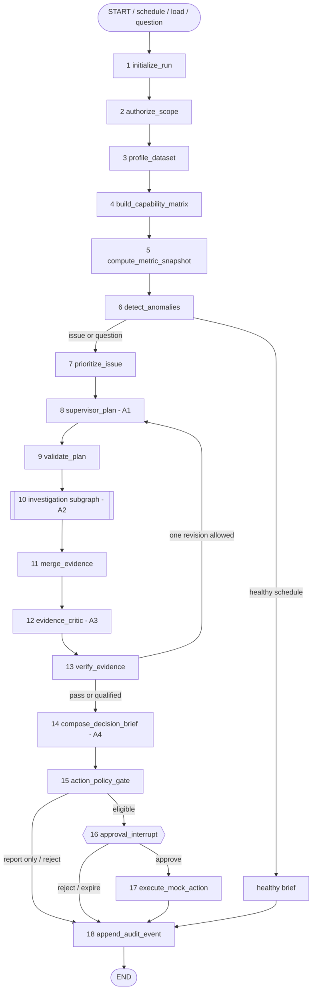
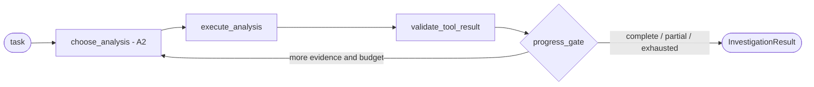

# Mobility Decision Copilot: Detailed Solution Architecture

Date: 2026-09-04  
Status: Frozen pending dataset profiling

## 1. Architecture decision

Build a **controlled multi-agent analytical workflow**, not an autonomous swarm and not a document chatbot:

- Four LLM specialists with separate prompts, inputs, outputs, and permissions.
- Two components make dynamic agentic decisions: Supervisor and Investigator. Only the Investigator runs a bounded tool-selection loop.
- Eighteen top-level LangGraph nodes plus one reusable four-node investigation subgraph.
- DuckDB and governed metric contracts calculate operational facts.
- Langfuse observes and evaluates the workflow; it is not the audit ledger.
- No document RAG or neural reranker in the mandatory path while the only resource is structured trip logs.
- A conditional fifth Knowledge Agent and seven-node retrieval subgraph only if policies, SLAs, contracts, SOPs, or historical reports arrive.

LangGraph distinguishes predetermined workflows from agents that dynamically choose tools. This system deliberately combines them instead of making every step agentic. See [LangGraph workflows and agents](https://docs.langchain.com/oss/python/langgraph/workflows-agents).

## 2. Vocabulary

| Concept | Meaning here | Example |
|---|---|---|
| Agent | LLM component making a bounded semantic decision or tool selection | Investigator chooses the next approved analysis |
| Node | One graph state transition with one responsibility | `verify_evidence` |
| Tool | Typed deterministic function exposed to an agent | `rank_contributors(...)` |
| Service | Non-LLM application component | DuckDB metric engine or audit repository |
| Worker task | Isolated invocation of a reusable subgraph | Vendor-contribution investigation |

Multi-agent quality comes from meaningful context, tool, and policy boundaries—not agent count.

## 3. Four LLM specialists

### A1. Supervisor and Planning Agent

- **Purpose:** Turn the selected issue or question into a small investigation plan.
- **Input:** Persona, request mode, capability matrix, anomaly/question, available tools, and remaining budget.
- **Output:** Typed `InvestigationPlan` containing required metrics, comparisons, tasks, dependencies, allowed dimensions, and stop conditions.
- **Permissions:** No raw SQL, retrieval, calculation, or action execution. It selects only registered tasks.
- **Boundary:** Broad planning context, zero authority to create facts.

### A2. Investigation Agent

- **Purpose:** Resolve one bounded task with governed read-only analytical tools.
- **Input:** One task, compatible tools, existing evidence summaries, and budget.
- **Output:** Evidence IDs, measured contributors, coverage, quality warnings, direct findings, inferences, and unresolved questions.
- **Permissions:** No arbitrary SQL, writes, cross-tenant access, or unrestricted APIs.
- **Limits:** Configured tool-call, row, time, token, and cost limits.

### A3. Evidence Critic

- **Purpose:** Challenge draft findings before they reach the user.
- **Input:** Evidence package, claims, metric definitions, and claim rules.
- **Output:** Supported claims, overclaims, missing caveats, contradictions, and pass/revise/abstain.
- **Permissions:** No tools, database, retrieval, or actions.
- **Limit:** One review and at most one correction cycle.

### A4. Briefing and Action-Drafting Agent

- **Purpose:** Create the operations brief, leadership narrative, and bounded action proposal from verified evidence.
- **Input:** Verified findings, persona templates, confidence/caveats, and allowed action types.
- **Output:** Typed `DecisionBrief` and `ActionProposal`.
- **Permissions:** No database, retrieval, or execution. It cannot introduce a factual claim without an evidence ID.

### Conditional A5. Knowledge Agent

Add only if documents contain decision-relevant knowledge absent from structured fields. It returns cited `DocumentEvidence` and has no metric or action permissions.

## 4. Why data domains are workers, not agents

Vendor, route/shift, GPS, cost, feedback, and safety analyses use the same tenant, governed engine, policy boundary, and result schema. They are parallel worker tasks executed through the same Investigation Agent subgraph.

Separate permanent agents would add prompts, state, model calls, latency, and merging failures without creating a real boundary. LangGraph's orchestrator-worker pattern and `Send` support isolated dynamic workers when the validated plan calls for them. See [orchestrator-worker guidance](https://docs.langchain.com/oss/python/langgraph/workflows-agents#orchestrator-worker).

## 5. Main graph: 18 nodes

`START` and `END` are not counted.

| # | Node | Type | Responsibility | Failure/degraded route |
|---:|---|---|---|---|
| 1 | `initialize_run` | Deterministic | Create run, trace, data version, request mode, budget, and tenant-safe IDs | Reject malformed request |
| 2 | `authorize_scope` | Deterministic | Enforce tenant, persona, metrics, dimensions, and tools | Fail closed |
| 3 | `profile_dataset` | Deterministic | Read/calculate schema and data-quality facts | Continue with supported capabilities |
| 4 | `build_capability_matrix` | Deterministic | Mark analyses supported, derivable, or unavailable | Disable unsupported branches |
| 5 | `compute_metric_snapshot` | Deterministic | Compute versioned metrics, baselines, population, and freshness | Quality-qualified snapshot |
| 6 | `detect_anomalies` | Deterministic | Compare against available SLA, history, or peers | Healthy-brief route |
| 7 | `prioritize_issue` | Deterministic | Select the highest-value issue with configurable materiality/confidence rules | Low-confidence investigation only |
| 8 | `supervisor_plan` | LLM A1 | Create bounded typed plan | Parse retry once, then fallback |
| 9 | `validate_plan` | Deterministic | Check tools, dimensions, capabilities, budget, and dependencies | Remove invalid tasks or stop |
| 10 | `run_investigations` | Subgraph A2 | Dispatch isolated tasks through the reusable investigator | Preserve successful branches |
| 11 | `merge_evidence` | Deterministic | Deduplicate and link evidence to data/metric versions and claims | Flag contradictions/gaps |
| 12 | `evidence_critic` | LLM A3 | Detect unsupported language and missing caveats | Revise once or abstain |
| 13 | `verify_evidence` | Deterministic | Enforce arithmetic, provenance, freshness, policy, and confidence | Safe partial answer |
| 14 | `compose_decision_brief` | LLM A4 | Produce dual brief and action draft | Deterministic template fallback |
| 15 | `action_policy_gate` | Deterministic | Validate action, parameters, evidence, expiry, and authorization | Report-only/reject route |
| 16 | `approval_interrupt` | Human | Pause for approve, reject, or edit with serializable payload | Rejection/expiry to audit |
| 17 | `execute_mock_action` | Deterministic | Idempotently create mock escalation/ticket/watchlist/draft | Bounded retry, never duplicate |
| 18 | `append_audit_event` | Deterministic | Persist run, evidence, decision, approval, and receipt refs | Surface ledger failure |



The revision edge requires `revision_count <= 1`. Every loop has hard tool-call, time, token, and cost limits.

## 6. Investigation subgraph: four nodes

`run_investigations` invokes this subgraph per validated task. Independent calls may run in parallel.

| Node | Type | Responsibility |
|---|---|---|
| `choose_analysis` | LLM A2 | Select one next governed tool or finish |
| `execute_analysis` | Deterministic | Run a registered parameterized query/computation |
| `validate_tool_result` | Deterministic | Check schema, provenance, coverage, row limits, and errors |
| `progress_gate` | Deterministic | Continue, stop, qualify, or return partial evidence |



Use default per-invocation subgraph persistence so parallel calls remain isolated while inheriting the parent checkpointer. This is the current recommended mode for independent multi-agent calls. See [LangGraph subgraph persistence](https://docs.langchain.com/oss/python/langgraph/use-subgraphs#subgraph-persistence).

## 7. Governed analytical tools

The LLM selects registered metric IDs, dimensions, filters, and comparison modes; it never writes arbitrary SQL.

```text
get_metric(metric_id, window, filters, grain)
compare_metric(metric_id, current_window, reference_mode, filters)
rank_contributors(metric_id, dimension, window, filters, min_volume)
get_distribution(metric_id, dimension, window, filters)
estimate_impact(issue_id, impact_model_id)
get_quality_report(fields_or_metric_ids)
get_bounded_examples(evidence_id, limit, redaction_policy)
simulate_action(action_type, target_ids, parameters)
```

Every tool result includes evidence/query ID, metric contract/version, data version, window, filters, grain, numerator, denominator, value/unit, comparison, population, coverage, warnings, and tenant-safe provenance.

The metric registry owns definition, formula implementation, owner, allowed dimensions, exclusions, unit, grain, freshness, authorization, and edge-case behavior. Incompatible groupings are rejected, not approximated.

## 8. RAG decision

### Mandatory path: no document RAG

The live statement names structured trip logs, not a document corpus. Therefore:

- SQL retrieves operational facts.
- The metric catalog retrieves approved definitions by ID/alias.
- Evidence IDs retrieve computed results for synthesis.
- The LLM generates only from verified evidence objects.

This is retrieval-grounded generation over structured evidence, but it should not be advertised as vector RAG. Embeddings and cross-encoders do not calculate on-time arrival, cost, occupancy, or affected employees.

### Conditional activation gate

Activate document RAG only when all are true:

1. Documents contain decision-relevant knowledge absent from structured fields.
2. At least five golden questions require policy/SLA/contract/SOP evidence.
3. Tenant, role, version, effective date, page/section, and citations are preservable.
4. Retrieval evaluation beats a lexical-only baseline inside the latency budget.

If any gate fails, RAG stays disabled.

## 9. Conditional hybrid RAG and reranking: seven nodes

If the gate passes, add A5 and a subgraph parallel to analytical investigation:

| Node | Responsibility |
|---|---|
| `classify_knowledge_need` | Form the policy query and required authority/effective date |
| `authorize_and_filter` | Apply tenant, role, document type, entity, version, and effective-date filters before search |
| `parallel_retrieve` | Run BM25/lexical and embedding retrieval for recall |
| `fuse_candidates` | Reciprocal-rank fusion while retaining component ranks/provenance |
| `rerank_candidates` | Second-stage cross-encoder or evaluated constrained-model ordering against the original question |
| `dedupe_and_pack` | Remove overlap and preserve authority/diversity within context budget |
| `verify_citations` | Validate passage, version, authorization, and claim support |

Evaluation starting point, not a fixed configuration:

- Retrieve about 15-25 candidates from each first-stage retriever.
- Fuse and rerank roughly 15-25 unique candidates.
- Pass about 4-6 authoritative, non-duplicative passages.
- Treat scores as ranking diagnostics, not confidence probabilities.

Tune with evidence recall, MRR/nDCG, citation precision, duplicate rate, latency, cost, and ACL violations. Reranking is a second-stage ordering mechanism over a high-recall candidate set; see [Cohere Rerank](https://docs.cohere.com/v2/docs/rerank).

Do not initially add HyDE, multi-query expansion, knowledge graphs, OpenKB/PageIndex, LLM-only reranking, whole-document prompting, or post-generation access filtering. Add a strategy only to fix a measured failure.

## 10. Two ranking problems

### Operational prioritization

Rank anomalies using deterministic configurable features: safety override, SLA/trend gap, affected trips/employees, cost impact, persistence, coverage/confidence, and minimum volume. Do not freeze weights or thresholds before profiling the dataset. Expose score components in the UI.

### Document reranking

Order policy/document passages after ACL-filtered hybrid retrieval. It is conditional and never alters an operational metric.

## 11. Shared typed state

```python
class MobilityState(TypedDict):
    run: RunContext
    request: RequestContext
    budget: ExecutionBudget
    data_profile: DataProfile
    capabilities: CapabilityMatrix
    metric_snapshot: list[MetricEvidence]
    anomaly_candidates: list[Anomaly]
    selected_issue: Anomaly | None
    investigation_plan: InvestigationPlan | None
    investigation_results: Annotated[list[InvestigationResult], operator.add]
    document_evidence: Annotated[list[DocumentEvidence], operator.add]
    evidence_package: EvidencePackage | None
    critique: Critique | None
    verification: VerificationResult | None
    decision_brief: DecisionBrief | None
    action: ActionProposal | None
    approval: ApprovalDecision | None
    execution_receipt: ExecutionReceipt | None
    errors: Annotated[list[WorkflowError], operator.add]
    audit_event_ids: Annotated[list[str], operator.add]
```

All models are JSON-serializable and versioned. Use explicit reducers for parallel lists; keep large data outside graph state behind evidence IDs.

## 12. Approval, recovery, and audit

Compile the parent graph with a checkpointer and tenant-safe `thread_id`. SQLite is acceptable locally; PostgreSQL is the production story. LangGraph distinguishes thread checkpoints from cross-thread stores and requires thread IDs for persistence. See [LangGraph persistence](https://docs.langchain.com/oss/python/langgraph/persistence).

Approval payload:

```json
{
  "action_id": "...",
  "action_type": "create_vendor_investigation",
  "targets": ["vendor-token"],
  "reason": "...",
  "evidence_ids": ["..."],
  "expected_effect": "...",
  "risk": "low",
  "expires_at": "...",
  "idempotency_key": "..."
}
```

Rules:

- Put `interrupt()` in a dedicated approval node.
- Never perform a non-idempotent write before it; LangGraph restarts the node on resume.
- Recheck authorization, parameters, evidence version, expiry, and preconditions after approval.
- Enforce idempotency at the action repository boundary.
- Audit proposal, approval/rejection/edit, attempts, receipt, and final status.

See current [LangGraph interrupt rules](https://docs.langchain.com/oss/python/langgraph/interrupts#rules-of-interrupts).

## 13. Verification and confidence

The deterministic verifier ensures:

- Every displayed number exists in evidence.
- Units, filters, populations, and periods are compatible.
- Current/reference windows are valid.
- Claim evidence is present and authorized.
- Missing GPS/roster/join coverage appears in caveats.
- “Caused” is rejected without causal evidence; use “contributed,” “associated,” or “coincided.”
- Sparse groups are suppressed or qualified.
- Action type and parameters are allowlisted.

Confidence is computed from data coverage/quality, statistical/material support, agreement across signals, freshness, and investigation completeness—not the LLM's self-rating.

## 14. Langfuse trace

One graph run is one root trace:

```text
mobility_run
  authorize_scope
  profile_dataset
  compute_metric_snapshot
  detect_anomalies
  supervisor_plan
  investigation.vendor
    choose_analysis
    tool.rank_contributors
  investigation.gps
    choose_analysis
    tool.get_quality_report
  merge_evidence
  evidence_critic
  verify_evidence
  compose_decision_brief
  approval_interrupt
  execute_mock_action
  append_audit_event
```

Record safe tenant, run/thread ID, workflow/prompt/model/metric/data versions, task/tool, evidence count, latency, usage/cost, retries, outcome, approval, and audit ID. Redact PII and secrets.

Langfuse supports LangChain callbacks and manual Python/OpenTelemetry instrumentation, so it observes the graph without dictating orchestration. See [Langfuse tracing](https://langfuse.com/docs/observability/get-started).

## 15. Evaluation

### Deterministic tests

- Hand-calculated metric fixtures for nulls, duplicates, cancellations, zero denominators, time zones, and late data.
- Capability behavior without GPS, cost, roster, feedback, or SLA.
- Plan validator blocks arbitrary SQL, unsupported dimensions, excess tasks, and cross-tenant scope.
- Verifier catches changed numbers, missing evidence, incompatible periods, and unsupported causal claims.
- Approval reject/edit/expiry, crash/resume, and duplicate execution.

### Trajectory tests

- Correct tool category and maximum calls.
- Stops when evidence is sufficient.
- Returns partial evidence when one branch fails.
- Abstains when evidence is inadequate.
- Uses at most one correction cycle.

### Narrative tests

- Operations and leadership outputs contain identical facts.
- Every factual claim resolves to evidence.
- Missing-data caveats are visible.
- LLM judges assess only clarity, relevance, and explanation groundedness—not arithmetic, security, or authorization.

Once the real schema is known, create 20-30 golden cases and five corrupted-data variants. No cross-tenant leak, wrong governed metric, unsupported citation, or unauthorized action may pass.

## 16. Security boundaries

- Authorize before retrieving metrics or documents.
- Use read-only, template-based analytical queries.
- Tokenize/redact employee and driver IDs in prompts, traces, and UI.
- Treat user text, dataset text, documents, peer-agent output, and tool output as untrusted.
- Validate structured output before state updates.
- Expose no shell, generic SQL/HTTP/URL/filesystem, or real vendor-system tool.
- Propose, validate, approve, revalidate, idempotently execute, and audit every write.
- Fail closed for access/actions with a useful non-sensitive explanation.

## 17. Judge-proof UI

One screen should expose:

1. Proactive morning brief and top issue.
2. Metric, SLA/history/peer comparison, population, and freshness.
3. Vendor/route/GPS/cost/feedback evidence drawer.
4. Direct versus inferred claims, confidence components, and caveats.
5. Action, expected effect, risk, and approve/reject/edit.
6. Forwardable leadership narrative from the same evidence.
7. Trace ID, audit ID, versions, latency/cost, and evaluation status.

The dashboard is not the product; the proactive decision and controlled intervention are.

## 18. Implementation order

### Before data arrives

1. Pydantic state/output contracts.
2. Metric registry interface and synthetic fixtures.
3. Dataset adapter and profiler.
4. Graph skeleton with mocked deterministic tools.
5. One synthetic golden path and one degraded path.
6. Checkpoint, approval, idempotency, audit, and trace skeleton.
7. Minimal UI on stable sample responses.

### On receipt

1. Preserve and checksum source.
2. Profile schema, types, nulls, duplicates, categories, timestamps, units, keys, and join coverage.
3. Map fields and build capability matrix.
4. Hand-reconcile initial metrics.
5. Select the strongest real issue and supported comparison.
6. Enable only supported workers.
7. Record actual formulas, thresholds, values, and golden cases in the decision register.

### Build sequence

1. One metric end to end.
2. Proactive trigger/prioritization.
3. Two strong investigation dimensions.
4. Verified dual brief.
5. Approval/audit.
6. Traces/evaluations.
7. Messy-data variants.
8. Additional supported dimensions.
9. Optional RAG only if its gate passes.

## 19. Team split

| Owner | Responsibility | Contract |
|---|---|---|
| Data/metrics | Adapter, DuckDB, registry, anomaly/contribution tools | Typed evidence objects |
| Agent/backend | LangGraph, API, checkpoint/recovery | Pydantic state/contracts |
| Product/frontend | Brief, investigation, approval, leadership/trust views | Stable API fixtures from hour one |
| Quality/demo | Langfuse, tests, audit proof, deck, demo script | Requirement-to-proof matrix |

With three people, combine quality/demo with agent/backend. Split by engineering boundary, not one person per agent.

## 20. Cuts and final pitch

Cut in order: document RAG/A5, extra investigation dimensions, general chat, rich export, PostgreSQL/deployment polish.

Never cut: one correct governed metric, contextual benchmark, proactive trigger, evidence-backed investigation, verified dual output, approval/audit, and deterministic fallback.

Judge-facing wording:

> We use four specialized LLM roles, but only where semantic judgment helps. LangGraph controls an 18-node workflow; a bounded investigator subgraph runs supported domain analyses in parallel. All metrics, thresholds, authorization, evidence checks, approvals, and actions remain deterministic. Because the supplied resource is structured trip data, SQL is operational truth. Hybrid RAG and reranking are a conditional policy-evidence lane, activated only if decision-relevant documents arrive. Every conclusion is versioned, traceable, approval-gated, and auditable.
