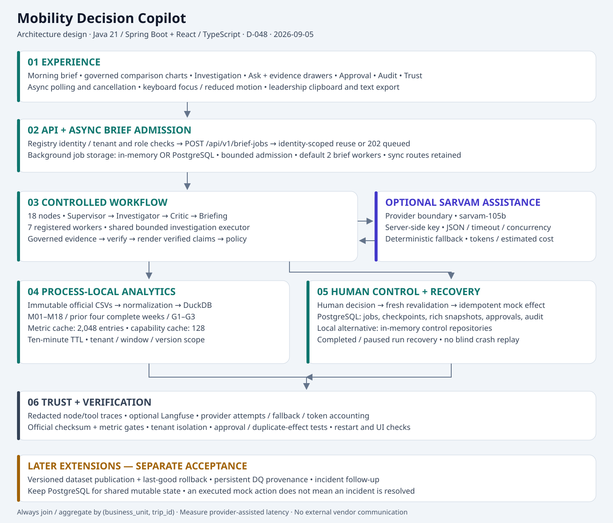

# Mobility Decision Copilot: High-Level Design

> Branch scope: implementation descriptions refer to Java-branch-2. This Java-branch copy transfers documentation only; see [branch scope](architecture-branch-scope.md).

Updated: 2026-09-05. Status: implemented baseline plus explicitly proposed extensions. Decisions: D-028, D-034–D-046 and D-048; plan review D-047.

## Architecture at a glance

The editable SVG and [standalone architecture page](high-level-design-visual.html) reflect this revision. The older PNG export is historical and must not be used to describe the new async/Sarvam architecture.

~~~mermaid
flowchart TB
    UI["React dashboard: briefs, charts, evidence, Ask, approval, audit, trust"]
    API["Spring Boot API: registry identity, tenant and role checks"]
    JOB["AsyncBriefService: identity-scoped reuse and bounded admission"]
    STORE[("BriefJobStore: in-memory OR PostgreSQL")]
    DISPATCH["Scheduled dispatcher: bounded background brief workers"]
    ENGINE["DeterministicWorkflowEngine: 18 nodes / 4 logical agents"]
    TOOLS["7 registered investigation workers / shared bounded executor"]
    CACHE["Bounded metric and capability caches"]
    DUCK[("Process-local DuckDB / governed M01-M18 SQL")]
    CSV["Immutable official CSVs / normalized composite tenant keys"]
    MODEL["LanguageModelPort: unavailable OR bounded Sarvam adapter"]
    VERIFY["Evidence merge, critic, deterministic verification"]
    BRIEF["Verified claim rendering / operations and leadership outputs"]
    GATE["Deterministic action policy"]
    APPROVAL["Human approve / reject / edit"]
    EXEC["Fresh evidence and proposal revalidation / idempotent mock action"]
    CONTROL[("Control repositories: checkpoint, rich snapshot, approval, receipt, audit")]
    TRACE["Redacted OTel / optional Langfuse export"]
    UI --> API
    API -->|"POST brief-jobs"| JOB
    JOB --> STORE
    STORE --> DISPATCH
    DISPATCH --> ENGINE
    API -->|"sync workflows and questions"| ENGINE
    API -->|"GET job/workflow"| CONTROL
    ENGINE --> TOOLS --> CACHE --> DUCK
    CSV --> DUCK
    ENGINE --> MODEL
    ENGINE --> VERIFY --> BRIEF --> GATE
    GATE -->|"eligible"| APPROVAL
    APPROVAL -->|"approve or edit"| EXEC --> CONTROL
    APPROVAL -->|"reject"| CONTROL
    GATE -->|"report only"| CONTROL
    ENGINE --> CONTROL
    BRIEF --> API
    ENGINE -.-> TRACE
~~~

The browser uses async brief submission and polling. Synchronous workflow/question routes remain supported. Diagram edges describe responsibility and data flow; the verification and approval boxes are nodes inside the engine, not separately deployed services.

## Runtime request flow

1. Resolve registered identity and enforce tenant/persona permissions before reuse lookup or analytics.
2. POST /api/v1/brief-jobs returns 202 with an existing or newly queued job. Reuse is scoped to actor, tenant, roles, persona, as-of date, data/metric/workflow/prompt/model versions and BRIEF_CACHE_NAMESPACE.
3. A scheduled dispatcher claims jobs. PostgreSQL uses atomic claims with FOR UPDATE SKIP LOCKED. Worker threads execute the existing governed workflow.
4. Load the data catalog, then detect and investigate using cached governed metrics. A healthy dataset window takes the healthy-brief route.
5. Merge scoped evidence, retain partial-result caveats and verify claims. The model may select verified claim IDs for leadership output; deterministic code renders their text.
6. Apply policy. Missing/failed verification means report-only. Eligible proposals pause for human approval.
7. Save the rich run snapshot and checkpoint through control repositories. GET job returns status and, when complete, renders the current run state; a completed job may contain a workflow awaiting approval.
8. Approval or edit resumes at node 17. Recheck authority, expiry, fresh evidence and the complete approved proposal before the idempotent mock effect. Rejection and failed revalidation produce audited terminal states.
9. Polling backs off and is cancelled when the user changes tenant/date or starts a newer request. Stale brief, question, approval and audit responses cannot replace the active screen.

## Component and storage ownership

| Component | Implemented responsibility |
|---|---|
| Java 21 / Spring Boot | Product API, composition, scheduling and deterministic application services |
| React / TypeScript | Responsive operations workspace; governed current/baseline charts, evidence, questions, approval, audit, trust and text sharing |
| DeterministicWorkflowEngine | Four logical roles, 18 top-level nodes and bounded investigation; LangGraph4j remains gated and inactive |
| DuckDB / AnalyticsStore | Load normalized analytical data within one process; governed reads; never mutable shared approval/audit state |
| BoundedMetricCache | In-process TTL/LRU caching and shared computation for identical in-flight metric queries |
| PostgreSQL profile | Shared jobs, rich workflow snapshots, checkpoints, approvals, idempotency/receipts and append-only audit |
| In-memory profile | Local demo control state; no cross-process durability or shared queue |
| LanguageModelPort / Sarvam | Optional bounded JSON assistance; server-side key; no SQL, metric or action authority |
| OTel / Langfuse | Diagnostics, node/tool durations and provider/token accounting; separate from business audit |
| Identity/target configuration | Current registry/configuration-driven policy; PostgreSQL does not yet provide a tenant-management UI or configuration service |

Every trip-level join/aggregate uses (business_unit, trip_id). Source product_type maps to mode, shift_type to shift_id, office to site_id and trip_direction to direction. M01–M18, configured-target labels, the prior-four-complete-week baseline and G1–G3 remain authoritative. Immutable files stay under outputs/official dataset/.

## Performance and reliability boundaries

| Mechanism | Current setting / behavior |
|---|---|
| Metric cache | 2,048 entries, ten-minute TTL; tenant/window/filter/data-version scoped; failed calculations not cached |
| Capability cache | 128 entries, ten-minute TTL |
| Async admission | 256-job limit; BRIEF_WORKERS defaults to 2, allowed 1–16 |
| Investigation executor | 4 shared threads, queue capacity 64; rejected/timed-out work yields partial/failure evidence |
| Workflow bounds | Default 4 investigation steps, 12 tool calls, 1 correction cycle, 10-second tool timeout |
| Brief reuse | Ten minutes; namespace must change with answer/policy-affecting configuration |
| Precomputation | Optional, off by default; configured historical date/tenants and demo transport-manager identity |
| Sarvam | Default model sarvam-105b; 2 concurrent calls by default; timeout, JSON/token bounds, 30-second failure cooldown |
| Cost | Configured rate estimates; unknown when not reliably calculable; no hard monetary-budget enforcement |
| Traces/local views | Bounded trace registry; local completed run registry pruned around 512 entries |

Sarvam is selected with LANGUAGE_MODEL=sarvam and SARVAM_API_KEY. The default is LANGUAGE_MODEL=none and deterministic fallback. The direct HTTP adapter does not require the optional Spring AI profile. Live provider latency has not been validated with a key.

PostgreSQL snapshots preserve completed/paused run evidence across a process restart. They do not provide arbitrary-node crash continuation. An abandoned job is failed visibly rather than automatically replayed. Checkpoint, approval, audit and rich-snapshot writes are not a single transaction; missing state must fail closed. Brief-generation elapsed time freezes at completion/pause; it is not polling latency, and a resumed run's lifetime may include the approval wait.

Replicas can share PostgreSQL jobs/control state, but each loads its own analytical data and has local metric/model concurrency limits. The synchronous compatibility routes bypass async queue admission. No sustained production-capacity or fleet-wide rate-limit claim is made.

## Current API contract

Source: [OpenAPI 0.3.0](../contracts/openapi/mobility-copilot.yaml).

| Method/path | Purpose |
|---|---|
| POST /api/v1/brief-jobs | Enqueue or reuse a scoped brief |
| GET /api/v1/brief-jobs/{jobId} | Status plus completed run output |
| GET /api/v1/briefs/morning | Synchronous brief compatibility route |
| POST /api/v1/workflows | Synchronous workflow request |
| GET /api/v1/workflows/{workflowId} | Scoped run view |
| POST /api/v1/questions | Constrained contextual question |
| GET /api/v1/approvals/{approvalId} | Approval preview |
| POST /api/v1/approvals/{approvalId}/decision | Approve, reject or edit |
| GET /api/v1/audit/{workflowId} | Tenant-scoped audit history |
| GET /api/v1/demo/brief | Existing demo contract |
| GET /actuator/health | Health and configured capability reporting |

X-Business-Unit, X-Actor-Id and X-Roles are resolved through the governed identity layer. Current demo identity controls are not a deployed production authentication system.

## Aligned extensions — proposed, not implemented

| Extension | Architectural fit and acceptance condition |
|---|---|
| Immutable analytical publication | Separate dataset version from workflow run ID. Stage/validate/finalize, atomically publish a manifest, pin one version per request and retain last-good data on failure. Data hashes and WorkflowSnapshotStore alone do not implement this. |
| Persistent DQ/provenance reports | Link bounded source-row references and quality failures to data version and tenant; apply role-based redaction. Extend existing ingestion/evidence services. |
| Incident follow-up | Separate stable incident ID, run observations and action IDs. Add acknowledgement/reopen/outcome checks; mock execution never means operational resolution. |
| Ingestion service / Parquet | Optional measured optimization. Keep mutable shared control state in PostgreSQL; do not have an API reader and worker writer share an active native DuckDB control file. |
| Enterprise deployment | Authenticated ingress, secrets, retention/backups, shared rate limits and representative load tests remain deployment work. AWS infrastructure is not implied to be deployed. |

LangGraph4j remains conditional on its routing/persistence/trace spike. A Knowledge Agent/RAG lane remains disabled until a decision-relevant document corpus and retrieval evaluation justify it.

## Validation evidence

See [component/node review](component-node-review-2026-09-05.md) for the completed 136 default backend checks, 6 dedicated PostgreSQL checks, 8 UI tests, production build, official-data gates and actual PostgreSQL restart check. The small warm benchmark separates computation from reused-run reads; it does not measure live Sarvam or production capacity. See [plan alignment review](plan-alignment-review-2026-09-05.md) for design findings behind the proposed extensions.
