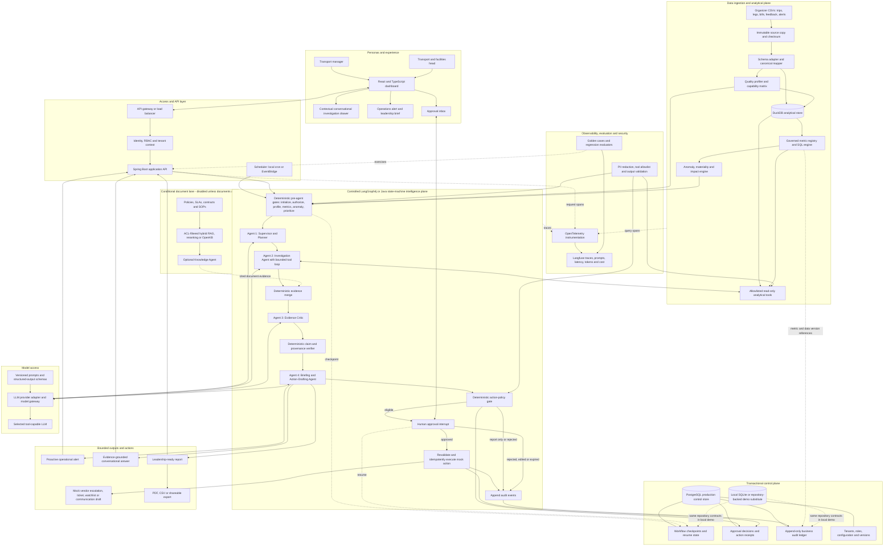

# Mobility Decision Copilot: High-Level Design

Status: accepted for implementation; validated against the official dataset on 2026-09-04 (D-029 through D-033)
Last reviewed: 2026-09-05
Decision source: D-025 through D-035 in `hackathon-decision-register.md`; dataset bindings in `dataset-profile-and-capability-matrix.md`

## Shareable HLD artifact

- Editable vector source: `architecture/mobility-decision-copilot-hld.svg`
- High-resolution presentation export: `architecture/mobility-decision-copilot-hld.png`
- The earlier `high-level-design-visual.html` is retained only as an interactive component explainer; it is not the submission HLD.

## 1. System architecture

## 2. Runtime path

```mermaid
flowchart LR
    I[Schedule or user request] --> AU[Authorize tenant and persona]
    AU --> DP[Load cached data profile and capabilities]
    DP --> MS[Compute or load governed metric snapshot]
    MS --> AD[Detect and prioritize anomalies]
    AD -->|healthy| HB[Healthy-status brief]
    AD -->|material issue| SP[Supervisor plan]
    SP --> VI[Validate plan]
    VI --> INV[Parallel bounded investigation tasks]
    INV --> EV[Merge and version evidence]
    EV --> CR[Evidence Critic]
    CR --> DV[Deterministic verification]
    DV -->|one evidence correction| SP
    DV -->|pass or qualified| DB[Decision brief and action draft]
    DB --> PG[Action-policy gate]
    PG -->|report only| AL[Audit and finish]
    PG -->|eligible| HA[Human approval]
    HA -->|reject or expire| AL
    HA -->|approve| RE[Revalidate and idempotently execute mock action]
    RE --> AL
    HB --> AL
```

### Conversational investigation path

The dashboard includes an authenticated **Ask about this** drawer for questions and follow-ups about the current brief or anomaly. It is a second entry mode into the same controlled workflow, not a fifth agent and not a public, general-purpose chatbot.

1. The API attaches the tenant, persona, permitted dimensions, current anomaly/evidence IDs, date window and filter scope.
2. The Supervisor classifies the question into an allowlisted analytical intent and creates a bounded plan.
3. The Investigation Agent uses governed DuckDB tools; arbitrary text-to-SQL, raw database access and user-supplied tool names are rejected.
4. The Evidence Critic and deterministic verifier check every numerical claim, benchmark, coverage statement and evidence reference.
5. The Briefing Agent returns a direct answer with the governed metric, comparison, contributors, confidence/data-quality warning, evidence links and useful follow-up prompts.
6. A requested intervention becomes an action draft only. It still passes policy validation, explicit human approval, post-approval revalidation, idempotency and audit before execution.

Conversation state stores only safe scoped references such as tenant/persona, active anomaly, date/filter scope, evidence IDs and remaining loop budget—not raw operational rows or unrestricted long-term memory. The proactive morning brief remains the landing experience and golden demo; conversational Q&A is the drill-down layer.

## 3. Component ownership

| Component | Owns | Must not own |
|---|---|---|
| DuckDB | Canonical tenant-keyed trip, leg, bill, feedback and alert tables, SQL views, cached profiles, governed metric snapshots (M01-M18) and anomaly inputs | User accounts, concurrent approval state, production audit authority or LLM-generated facts |
| PostgreSQL | Production tenants/configuration, workflow checkpoints, approvals, action receipts and append-only business audit events | A duplicate copy of all raw trip/leg data unless production requirements later justify it |
| Local control-store adapter | Hackathon checkpoint, approval and audit persistence when PostgreSQL would delay the golden path | A claim of production-grade concurrency or durability |
| LangGraph4j adapter or Java state machine | Typed workflow state, routing, parallel investigation, bounded loops, approval pause/resume and recovery | Metric formulas, authorization policy or unrestricted peer-to-peer agent conversation |
| Langfuse | Diagnostic traces, latency, tokens, cost, prompt/model/workflow versions and evaluations | The authoritative business audit ledger |
| LLM roles | Planning, bounded tool choice, evidence criticism and audience-specific explanation | Raw SQL, calculations, authorization, anomaly thresholds, approvals or side effects |
| Spring Boot and Spring AI | Stable application APIs, validation, tenant propagation, model/provider abstraction, scoped tool calling and streaming run status | Business calculations implemented ad hoc outside governed services |
| Dashboard | Proactive brief, contextual conversational investigation, drill-down evidence, data-quality warnings, approval UX, audit view and leadership output | A generic public chatbot, hidden calculations, arbitrary SQL or actions without backend validation |

## 4. DuckDB and PostgreSQL boundary

DuckDB does not feed its raw operational tables into PostgreSQL during the hackathon. The workflow reads analytical facts from DuckDB and writes only compact control records to the audit repository:

- run, trace, tenant, user and workflow identifiers;
- metric/data versions and evidence references;
- selected anomaly and decision summary;
- proposed action and deterministic policy result;
- approval, rejection, edit or expiry event;
- execution attempt, idempotency key and mock receipt;
- final status and error classification.

This keeps analytical scans simple and fast while preserving a credible production story for concurrent state, access control and audit durability.

## 5. Core API surface

| Endpoint | Purpose |
|---|---|
| `POST /api/v1/runs` | Start an on-demand analysis using a persona, tenant and allowed scope |
| `POST /api/v1/scheduled-runs` | Internal scheduler entry point for proactive monitoring |
| `GET /api/v1/runs/{run_id}` | Read status, qualified failures, trace reference and outputs |
| `GET /api/v1/briefs/latest` | Load the latest operational and leadership briefs |
| `GET /api/v1/anomalies/{anomaly_id}` | Show benchmark, impact, confidence and linked evidence |
| `POST /api/v1/conversations/{conversation_id}/messages` | Ask a scoped question or follow-up about a brief/anomaly through the existing four-agent workflow |
| `POST /api/v1/actions/{action_id}/decision` | Approve, reject or edit a pending proposal |
| `GET /api/v1/audit/{run_id}` | Show the append-only business event history for a run |
| `GET /api/v1/health` | Report API, analytical store, control store, model and data freshness health |

Every endpoint receives authenticated tenant/persona context from the access layer. Public endpoints never accept arbitrary SQL, tool names, file paths, model prompts or external URLs.

## 6. Deployment profiles

### Hackathon profile

- React and TypeScript dashboard with a Spring Boot service on Java 21.
- Pin LangGraph4j 1.8.x only after the routing/parallelism/checkpoint-resume/serialization/trace spike passes; otherwise use the project-owned Java state-machine adapter.
- Local DuckDB file built from the seven organizer CSVs with the composite `(business_unit, trip_id)` key.
- Local scheduler for the proactive morning run.
- Repository-backed local checkpoint/audit implementation if PostgreSQL setup risks the demo.
- Hosted or self-hosted Langfuse, depending on event connectivity.
- One configurable LLM provider through the model adapter.
- Docker Compose or one-command local startup.

### Enterprise target

- CDN plus API gateway/load balancer, authenticated application API and horizontally scalable workers.
- Object storage for immutable source files and generated exports.
- DuckDB-backed analytical service for the scoped workload, or a replaceable warehouse adapter if scale/concurrency demands it.
- PostgreSQL for tenant/configuration, checkpoints, approvals, receipts and audit events.
- Event scheduler/queue for proactive and asynchronous runs.
- Secret manager, network isolation, centralized logs/metrics and controlled retention.

## 7. Non-negotiable boundaries

- Authorization happens before any analytical or document retrieval.
- Governed SQL calculates every number; LLMs never recreate formulas from prose.
- Anomaly detection and prioritization are deterministic and versioned.
- Only the Investigation Agent has a bounded tool-selection loop.
- Large datasets remain outside graph state; agents receive evidence references and compact summaries.
- Every loop has tool-call, time, token and cost limits.
- No side effect occurs before approval; authorization and evidence are revalidated afterward.
- Action execution is idempotent, and every transition is written to the audit ledger.
- Missing data disables unsupported analyses (for example cost per km for tenants with zero billed km) and qualifies conclusions instead of causing invented answers.
- Every join, cache key and evidence ID carries the tenant; `trip_id` alone is never a key.
- OpenKB/RAG remains disabled unless a document corpus arrives and passes evaluation.
