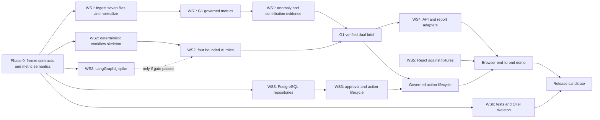

# Mobility Decision Copilot — Parallel Delivery Plan

## 1. Outcome

This is the execution plan for building the Java/React hackathon solution with multiple Claude sessions working in parallel. It converts the accepted architecture into six non-overlapping implementation workstreams coordinated by one Integration Owner.

The runtime product still has four logical AI roles. The number of coding workstreams does not change the agent architecture.

The delivery target is a judge-ready vertical slice on the official dataset:

```text
scheduled or user request
→ trusted tenant authorization
→ governed DuckDB metrics
→ deterministic anomaly detection
→ bounded cross-domain investigation
→ evidence criticism
→ operational and leadership briefs
→ approval request
→ post-approval revalidation
→ idempotent mock action
→ PostgreSQL audit record
→ React evidence and trust experience
```

## 2. Non-negotiable decisions

- Backend: Java 21, Spring Boot and Spring AI.
- Frontend: React, TypeScript and Vite.
- Analytics: DuckDB over immutable organizer CSV files.
- Control plane: PostgreSQL for checkpoints, approvals, idempotency and audit.
- Observability: OpenTelemetry exported to Langfuse; telemetry failure must not stop the workflow.
- Orchestration: project-owned `WorkflowEngine`; deterministic state machine is the guaranteed implementation. LangGraph4j is used only if the focused gate passes.
- Runtime AI roles: Supervisor/Planner, Investigation Agent, Evidence Critic, and Briefing/Action-Drafting Agent.
- Deterministic code owns tenant authorization, metric formulas, anomaly thresholds, evidence validation, approvals, action state and audit.
- The LLM may select allowlisted investigation tools and synthesize explanations from verified evidence. It may not generate executable SQL or authorize an action.
- Every trip join uses `(business_unit, trip_id)`.
- The official files under `outputs/official dataset/` are read-only.
- There is no RAG, embedding, reranking, vector database or OpenKB path for the current structured CSV dataset.
- External actions remain mocked for the hackathon.
- Use the GitHub account `magicashu`; do not switch accounts unless the user asks.

## 3. Team topology

Use one Integration Owner and six component workstreams.

| Owner | Branch | Exclusive responsibility |
|---|---|---|
| Integration Owner | `Java-branch` | Contracts, dependencies, shared configuration, docs, merge order, release gates and final demo |
| WS1 Governed Analytics | `feat/governed-analytics` | Seven-file ingestion, normalized DuckDB views, M01-M18, snapshots, anomaly and contribution analysis |
| WS2 Agent Workflow | `feat/agent-workflow` | Typed workflow, four AI roles, seven investigation workers, deterministic engine and LangGraph4j spike |
| WS3 Governance & Actions | `feat/governance-actions` | Tenant access, checkpoints, approval, revalidation, idempotency, mock execution and audit |
| WS4 Product API | `feat/product-api` | Morning brief, leadership report, contextual questions and thin REST controllers |
| WS5 React Experience | `feat/react-experience` | Brief, investigation, conversation, approval, audit and trust user interface |
| WS6 Quality & Telemetry | `feat/quality-telemetry` | Evaluation, security, recovery tests, traces, CI gates and demo verification |

Do not assign a separate coding worker to each runtime AI role. The four roles share a typed workflow state and belong together in WS2.

If fewer people or Claude sessions are available:

- four lanes: combine WS3 with WS4, and WS6 with the Integration Owner;
- three lanes: combine WS1, combine WS2+WS3+WS4, keep WS5, with the Integration Owner also owning WS6;
- two lanes: backend vertical slice and React experience, with one person acting as Integration Owner.

## 4. Critical path and dependency graph



The true critical path is:

```text
contract freeze
→ official ingestion
→ G1 M01/M03/M04/M09/M11
→ anomaly/contribution evidence
→ four-role workflow
→ verified dual brief
→ API/React integration
→ approval/audit
→ release rehearsal
```

PostgreSQL repositories, React fixture development, telemetry scaffolding and the LangGraph4j spike can run beside the data critical path.

## 5. Phase 0 — Freeze the seams before parallel coding

Target: first 45–90 minutes. The Integration Owner completes this phase before creating worktrees.

### 5.1 Freeze shared types

The Integration Owner exclusively owns and versions:

- `TenantContext`
- `MetricQuery` and `MetricResult`
- `AnomalyFinding` and `DataQualityFinding`
- `EvidenceItem` and `EvidenceBundle`
- `DecisionBrief`
- `ActionProposal`
- `ApprovalDecision`
- `ExecutionReceipt`
- `AuditEvent`
- `WorkflowState` and `WorkflowOutcome`
- OpenAPI request, response and error envelopes
- JSON schemas and React fixture payloads
- application ports for metrics, investigation, checkpoint, approval, execution and audit

Every evidence-backed number must preserve tenant, metric ID and version, data version, time window, filters, numerator, denominator or supporting count, coverage, confidence and provenance.

### 5.2 Resolve metric-contract questions

Before parallel implementation, reconcile the metric table, golden examples and tests for:

- M04/M05: exact eligible-leg denominator;
- M06: exact planned-leg denominator;
- M09/M10: aggregate ratio versus median language in examples;
- M11: “any low rating” versus driver-only wording in G2;
- M15: whether the P90 applies only to Sev-1/2 or all eligible severities;
- M18: rename to escort-present rate unless an actual compliance rule is supplied;
- the minimum-volume rule used to state that “every vendor rose.”

No worker may silently choose an interpretation. The resolved definitions must be updated in the dataset profile, decision register, SQL contract and deterministic fixtures together.

### 5.3 Baseline gate

```bash
git switch Java-branch
./scripts/verify.sh
git status --short
git rev-parse HEAD
```

Record the resulting commit as `BASELINE_COMMIT`. Add all agreed dependencies centrally before creating worktrees. Workers must request later shared dependency changes instead of editing root build files.

Phase 0 exits only when:

- Java contract tests compile;
- OpenAPI and JSON schemas validate;
- React fixtures match the frozen contracts;
- metric semantic questions are resolved or explicitly excluded from the first slice;
- the baseline verification is green;
- each path has exactly one write owner.

## 6. Worktree setup

Run from the canonical repository after Phase 0. Replace `<BASELINE_COMMIT>` with the frozen commit.

```bash
git worktree add ../hackathon-wt-governed-analytics -b feat/governed-analytics <BASELINE_COMMIT>
git worktree add ../hackathon-wt-agent-workflow -b feat/agent-workflow <BASELINE_COMMIT>
git worktree add ../hackathon-wt-governance-actions -b feat/governance-actions <BASELINE_COMMIT>
git worktree add ../hackathon-wt-product-api -b feat/product-api <BASELINE_COMMIT>
git worktree add ../hackathon-wt-react-experience -b feat/react-experience <BASELINE_COMMIT>
git worktree add ../hackathon-wt-quality-telemetry -b feat/quality-telemetry <BASELINE_COMMIT>
```

Workers commit only to their feature branches. They do not merge or push into `Java-branch`. The Integration Owner reviews and merges from the canonical checkout using the `magicashu` account.

## 7. Exclusive path ownership

### Integration Owner

```text
pom.xml
backend/pom.xml
backend/src/main/java/.../MobilityCopilotApplication.java
backend/src/main/java/.../config/**
backend/src/main/resources/application.yml
contracts/**
docs/**
infra/**
compose.yaml
README.md
AGENTS.md
SESSION_CONTEXT.md
scripts/verify.sh
```

### WS1 — Governed Analytics

```text
backend/src/main/java/.../ingestion/**
backend/src/main/java/.../metrics/**
backend/src/main/java/.../anomaly/**
backend/src/main/resources/sql/**
backend/src/test/java/.../ingestion/**
backend/src/test/java/.../metrics/**
backend/src/test/java/.../anomaly/**
backend/src/test/resources/fixtures/analytics/**
data/fixtures/**
data/corrupted/**
```

### WS2 — Agent Workflow

```text
backend/src/main/java/.../workflow/**
backend/src/main/java/.../evidence/**
backend/src/main/resources/prompts/**
backend/src/test/java/.../workflow/**
backend/src/test/java/.../evidence/**
backend/src/test/resources/fixtures/workflow/**
```

### WS3 — Governance & Actions

```text
backend/src/main/java/.../access/**
backend/src/main/java/.../approval/**
backend/src/main/java/.../action/**
backend/src/main/java/.../audit/**
backend/src/main/resources/db/migration/**
backend/src/main/resources/application-postgres.yml
backend/src/test/java/.../access/**
backend/src/test/java/.../approval/**
backend/src/test/java/.../action/**
backend/src/test/java/.../audit/**
```

### WS4 — Product API

```text
backend/src/main/java/.../reporting/**
backend/src/main/java/.../conversation/**
backend/src/main/java/.../api/**
backend/src/test/java/.../reporting/**
backend/src/test/java/.../conversation/**
backend/src/test/java/.../api/**
```

### WS5 — React Experience

```text
frontend/**
```

### WS6 — Quality & Telemetry

```text
backend/src/main/java/.../observability/**
backend/src/test/java/.../quality/**
backend/src/test/java/.../security/**
backend/src/test/java/.../architecture/**
backend/src/test/resources/fixtures/quality/**
evals/**
scripts/demo/**
.github/workflows/**
```

WS6 tests public interfaces. It must not rewrite another workstream's production behavior merely to make a test pass.

## 8. Component workstream outcomes

### WS1 — Governed Analytics and anomaly engine

Deliver:

1. Catalog and validate all seven files without modifying them.
2. Normalize field types and build tenant-keyed DuckDB views.
3. Enforce `(business_unit, trip_id)` in joins and regression tests.
4. Implement versioned SQL and registry entries for G1 metrics first: M01, M03, M04, M09 and M11.
5. Reconcile the ten hand-computed fixtures.
6. Build daily metric snapshots and capability status by tenant.
7. Return deterministic anomaly candidates with current value, baseline, deviation, impact, coverage and confidence.
8. Implement contribution tools for vendor, site/shift/direction, delay reason, cost/billing, feedback, tracking/safety and no-show/roster.
9. Implement G3 data-regime classification and healthy-status behavior.
10. Add remaining M01-M18 only after G1 is green.

Definition of done:

- G1 displayed numbers reproduce from DuckDB;
- no query can omit trusted tenant scope;
- unsupported metrics return typed unavailability and reason;
- outliers, negative bill adjustments, zero km and low coverage follow D-031;
- every result contains provenance and supporting population;
- official-data checksums remain unchanged.

### WS2 — Agent workflow and orchestration

Deliver:

1. Typed `WorkflowState` and an executable deterministic 18-node state machine.
2. Four logical roles: Supervisor, Investigator, Evidence Critic, Briefing/Action.
3. Seven allowlisted investigation worker adapters using application ports only.
4. A bounded Investigator loop with step, tool-call, latency and token limits.
5. Fan-out/fan-in that preserves successful branches and qualifies failed branches.
6. Evidence Critic rules that block unsupported numbers and single-vendor blame in G1.
7. Operational and leadership briefs derived from the same verified evidence bundle.
8. Healthy, no-action, correction-exhausted and partial-evidence terminal states.
9. Approval interruption through ports; never execute a side effect inside an LLM node.
10. A focused LangGraph4j spike for typed routing, fan-out/in, serialization, pause/resume and nested tracing. Keep it only if all pass without delaying G1.

Definition of done:

- the deterministic engine always remains runnable;
- one correction cycle maximum;
- all transitions are typed and traceable;
- no direct DuckDB/PostgreSQL access exists in workflow code;
- no general knowledge/RAG agent is added;
- G1 produces the expected trajectory and conservative recommendation.

### WS3 — Tenant governance, approval, action and audit

Deliver:

1. Trusted server-side tenant/actor context and role checks.
2. PostgreSQL/Flyway repositories for checkpoints, approvals, idempotency and append-only audit.
3. Approval states for approve, reject, edit and expire.
4. Durable pause and resume across process restart.
5. Post-approval authorization, evidence-version and state revalidation.
6. Idempotent mock executors for watchlist, investigation ticket, vendor escalation and communication draft.
7. Exactly-once effect behavior across duplicate approval/resume.
8. `APPROVED_NOT_EXECUTED` or equivalent for failed actions.
9. Audit events containing actor, tenant, action, evidence version, approval decision, timestamps and result.

Definition of done:

- cross-tenant access is denied before analytical/action tool use;
- no action executes before valid approval;
- rejected, expired or stale approvals cannot execute;
- restart resumes the correct state;
- duplicate execution returns one receipt;
- audit history cannot be updated or deleted.

### WS4 — Product API, reporting and conversation

Deliver these frozen endpoints, or request a contract change from the Integration Owner:

```text
GET  /api/v1/briefs/morning
POST /api/v1/questions
POST /api/v1/workflows
GET  /api/v1/workflows/{workflowId}
POST /api/v1/approvals/{approvalId}/decision
GET  /api/v1/audit/{workflowId}
```

Also deliver:

1. Thin Spring controllers and stable error envelopes.
2. Morning brief and leadership report mapping from one `EvidenceBundle`.
3. Healthy/anomalous/unsupported/degraded responses.
4. Contextual “Ask about this” limited to the authenticated tenant and governed tools.
5. Evidence and trace references in every analytical response.
6. Approval DTOs that expose action scope and evidence freshness.

Definition of done:

- controllers contain no SQL, formulas or workflow duplication;
- every number is cited to evidence;
- contextual conversation cannot become an unrestricted web or SQL assistant;
- forbidden/unsupported inputs fail safely and consistently;
- provider contract tests pass.

### WS5 — React decision experience

Deliver:

1. Morning brief with business impact and contextual benchmark.
2. Investigation drill-down across the supported domains.
3. Visible metric definition, filters, supporting count, freshness, confidence and caveats.
4. Approval preview with action, scope, evidence timestamp and consequences.
5. Approve/reject/edit/expired/result states.
6. Audit timeline and trace link without exposing chain-of-thought.
7. Trust panel showing data version, metric/prompt/model version, capability gaps, latency and model use.
8. Contextual conversation drawer only after the proactive path is stable.
9. Loading, empty, healthy, anomaly, unavailable and error states.

Definition of done:

- all UI data comes from frozen fixtures or APIs;
- no metric is calculated in the browser;
- unsupported evidence is never invented;
- TypeScript, tests and production build pass;
- the five-minute judge flow works at demo resolution.

### WS6 — Evaluation, security, recovery and observability

Deliver:

1. One OpenTelemetry root trace spanning authorization, workflow, agents, tools, metrics, critic, report, approval, revalidation, execution and audit link.
2. Safe metadata only: tenant-safe ID, workflow/metric/data/prompt/model versions, evidence count, retries, outcome, latency and token/cost use.
3. Redaction tests and non-blocking Langfuse export.
4. Deterministic evaluators for arithmetic, schemas, tenant scope, tool path, evidence support, approval and idempotency.
5. G1, G2 and G3 trajectory/evidence gates.
6. Ten metric fixtures and V1-V5 corrupted-data variants.
7. Adversarial cases for cross-tenant access, prompt injection, forged tool instructions, unsupported claims and approval bypass.
8. Recovery cases for timeout, retry exhaustion, partial branch failure, crash/resume and duplicate execution.
9. API/browser smoke scripts and a compact judge-readable scorecard.

Definition of done:

- zero cross-tenant leak, unsupported displayed number, unauthorized action or duplicate side effect;
- G3 escalation count is zero;
- 100% of displayed numbers resolve to evidence;
- Langfuse outage does not stop product execution;
- deterministic correctness never depends on an LLM judge;
- the demo can be verified with one command.

## 9. Delivery phases and gates

The time boxes below assume a 24-hour build window. Scale them proportionally without changing the gate order.

| Phase | Suggested time | Parallel work | Exit gate |
|---|---:|---|---|
| 0. Contract and risk freeze | 0–1 h | Integration Owner freezes types, metric semantics, API, dependencies and worktrees; WS2 runs isolated LangGraph4j spike only after contracts exist | All consumers compile against one contract; baseline green; orchestration choice recorded |
| 1. Deterministic foundations | 1–5 h | WS1 ingestion/G1 metrics; WS2 mocked workflow; WS3 persistence/approval state; WS4 API adapters; WS5 fixture UI; WS6 fast gates/OTel | Ten metric fixtures, composite-key test, backend/frontend builds and one mocked pause/resume pass |
| 2. G1 vertical integration | 5–10 h | Connect real metrics, contribution workers, critic, dual brief, API/UI, pending approval | One-command G1 reproduces every shown number, rejects vendor blame and stops before action |
| 3. Governed action and recovery | 10–14 h | WS3 real checkpoint/approval/audit; WS2 resume; WS6 stale/duplicate/crash tests; WS5 action states | Approve/reject/edit/expire pass; post-approval revalidation; exactly one effect; restart-safe audit trail |
| 4. Degraded data and breadth | 14–17 h | G2, G3, V1-V5, remaining workers/metrics, partial failures and safe conversation | G2 caveats visible, G3 never escalates, corruptions degrade explicitly, tenant/security gates green |
| 5. Observability and product polish | 17–20 h | Trace/cost/latency proof, trust panel, leadership brief, README/HLD/deployment story | One judge-readable trace and audit record, measured latency/model use, complete rubric-to-proof map |
| 6. Feature freeze and rehearsal | final 4 h | Release fixes, seed/reset, screenshots, backup video, pitch rehearsals | Two clean-start runs and three timed demo rehearsals pass |

Do not start breadth or visual polish while G1 is red.

## 10. Integration waves

Merge in fixed 90–120 minute windows rather than continuously.

Recommended order:

1. shared contracts and dependencies;
2. WS1 official ingestion and normalized views;
3. WS3 control repositories;
4. WS1 G1 metrics and anomaly tools;
5. WS2 workflow and four roles rebased onto real ports;
6. WS3 approval/action/audit lifecycle;
7. WS4 API/reporting;
8. WS5 React integration;
9. WS6 telemetry/evaluation/security gates;
10. G2/G3 and optional breadth.

Before each integration window:

- announce a 15-minute contract freeze;
- require workers to rebase on the latest `Java-branch`;
- merge shared contract changes first;
- merge sequentially and run the integration gate after each merge;
- tag green milestones: `foundation-green`, `g1-green`, `hardening-green`, `demo-rc1`.

Prefer small vertical commits. A handoff must state:

```text
Owned paths:
Branch and commit:
Contract/version consumed:
Feature demonstrated:
Tests and exact result:
Trace spans added:
Known failure/fallback:
Shared change requested:
Decision-register update required:
Integration steps:
```

## 11. Verification gates

### Every worker branch

Run the broadest relevant subset and report exact results:

```bash
./mvnw -pl backend -am test
npm --prefix frontend test -- --run
npm --prefix frontend run build
./scripts/verify.sh
```

Workers may omit unrelated expensive commands, but must say why.

### Every merge into `Java-branch`

- Java compile, JUnit and architecture tests;
- TypeScript check, UI tests and production build;
- OpenAPI/JSON-schema provider-consumer compatibility;
- ten deterministic metric fixtures;
- composite-key and cross-tenant regression;
- official-data checksum check;
- no secret, `.env`, database, runtime log or generated output committed.

### G1 release gate

- M01 is `4,357 / 19,913 = 21.9%` for the selected window;
- baseline is 12.3%;
- Clearwater Campus, LOGIN and 09:00–10:30 concentration is evidenced;
- all qualified vendors rose, so single-vendor blame is rejected;
- the recommendation is a site-shift watchlist plus investigation ticket;
- both brief formats share the same evidence bundle;
- every shown number links to metric version, filters and supporting count;
- execution remains `AWAITING_APPROVAL` until a valid decision.

### G2 release gate

- delayed trips, pickup lateness, low ratings and device-unreachable trends are correct;
- single-office scope, 3.9% feedback coverage and unsupported cost-per-km are explicit;
- confidence is moderate rather than high;
- no causal or cost-per-km claim is fabricated.

### G3 release gate

- sign-off alert step change is `DATA_REGIME_CHANGE`;
- it appears as a data-quality note;
- it is not ranked as an operational anomaly;
- it creates no action proposal or approval request.

### Zero-tolerance gates

- 10/10 deterministic fixtures pass;
- zero cross-tenant leakage;
- zero unauthorized or duplicate actions;
- zero G3 operational escalation;
- 100% of displayed numeric claims resolve to evidence;
- organizer checksums remain identical;
- no unbounded loop exists;
- the application remains usable when Langfuse is unavailable.

Use LLM judges only for clarity, relevance and leadership-readiness. Never use them to decide numerical, authorization, evidence or action correctness.

## 12. Observability and audit proof

Expected trace tree:

```text
request
└── authorize
    └── supervisor
        └── investigation
            ├── vendor tool
            ├── site/shift/direction tool
            ├── delay-reason tool
            ├── cost/billing tool
            └── feedback tool
        └── evidence critic
            └── report
                └── approval
                    └── revalidate
                        └── execute
                            └── audit-link
```

Langfuse is diagnostic observability, not the business system of record. PostgreSQL audit data remains authoritative. If export fails, preserve local trace IDs, show telemetry degraded, retry asynchronously and keep the workflow safe.

## 13. Security and recovery rules

- Derive tenant from authenticated server context, never user prose.
- Restrict analytical tools to read-only, allowlisted queries with enforced tenant filters.
- Validate every model and tool payload against a typed schema.
- Treat user text, model text and tool results as untrusted content.
- Do not log raw employee data, secrets, unrestricted prompts or chain-of-thought.
- Escape model-generated content in React.
- Retry only classified transient errors with bounded attempts.
- Preserve successful investigation branches and lower confidence when a sibling fails.
- Revalidate authorization, evidence version and action state after approval.
- Make every side effect idempotent before adding retry/resume.
- Never report success when execution failed; retain `APPROVED_NOT_EXECUTED` with an auditable error.

## 14. Failure fallbacks

| Failure | Required fallback |
|---|---|
| LangGraph4j spike fails | Use the deterministic Java state machine; do not add Python |
| LLM API unavailable | Render a labelled deterministic evidence template; keep metrics and controls live |
| Langfuse unavailable | Continue with local trace IDs and PostgreSQL audit; show captured trace during demo |
| PostgreSQL unavailable | Disable execution or use an explicitly approved local repository adapter; never claim unaudited success |
| One investigation worker fails | Continue with supported evidence, show missing branch and lower confidence |
| DuckDB raw scan is slow | Use versioned snapshots and retain one small live verification query |
| Official load fails | Show a typed data-quality failure or immutable prevalidated snapshot; never fabricate data |
| React fails | Demonstrate the same API/CLI output and backup recording |
| Mock action fails | Keep approved-not-executed status with safe retry and audit evidence |
| Contract mismatch | Block the merge; do not add release-time translation hacks |

## 15. Scope and cut ladder

### P0 — must ship

- seven-file official ingestion and composite tenant key;
- correct G1 M01/M03/M04/M09/M11;
- proactive anomaly with contextual benchmark;
- four logical AI roles with bounded execution and deterministic fallback;
- evidence critic and dual brief;
- one approval-gated mock action with revalidation, idempotency and audit;
- React judge flow;
- one complete root trace;
- G1, tenant isolation, metric, unsupported-claim and G3 suppression gates;
- one-command startup and backup artifacts.

### P1 — strong differentiators

- G2 degraded-data story;
- remaining M01-M18 and all seven investigation workers;
- V1-V5 corrupted variants;
- approval edit/expiry and deeper crash recovery;
- suggested contextual questions;
- rich confidence, capability, latency and cost views.

### P2 — cut first

1. conversational drawer enhancements;
2. extra visual polish and animation;
3. peer explorations outside G1/G2;
4. live LangGraph4j adapter when deterministic engine works;
5. full AWS provisioning beyond a credible deployment story;
6. less-used metric screens while retaining definitions/tests;
7. document RAG/OpenKB unless a real decision-relevant corpus appears.

Never cut G1 correctness, G2 caveats, G3 suppression, tenant isolation, evidence support, approval/idempotency, audit, trace proof, startup reliability or demo backup.

## 16. Judge-facing proof map

| Rubric | Weight | Demo proof |
|---|---:|---|
| Business impact and experience | 35% | G1 quantifies affected operations, finds the Clearwater morning LOGIN concentration, avoids false vendor blame, recommends a practical controlled intervention and produces operations + leadership views |
| Functionality | 25% | G1 runs live, G2 degrades honestly, G3 avoids false escalation, approval/action/audit work and corrupted data does not crash the system |
| Agentic design and cost at scale | 20% | Scheduled sensing, four bounded roles, parallel deterministic tools, one correction cycle, cached snapshots, trace tree and measured model/latency cost |
| Architecture and code quality | 20% | Typed Java workflow, governed DuckDB metrics, replaceable engine, tenant-safe API, durable PostgreSQL control plane, React contracts, tests and AWS-aligned HLD |

## 17. Release checklist

- `Java-branch` is green and tagged.
- Fresh clone/bootstrap/test/launch succeeds.
- Official dataset checksums are unchanged.
- G1 numbers and trajectory pass.
- G2 caveats are visible.
- G3 creates no operational escalation.
- V1-V5 fail gracefully.
- Cross-tenant and unauthorized-action tests pass.
- Duplicate approval/resume proves one effect.
- Every visible number exposes evidence metadata.
- One complete Langfuse trace is bookmarked or captured.
- Matching PostgreSQL business audit event is visible.
- Latency, model-call and cost measurements are captured.
- README, HLD, decision register and rubric-to-proof map are current.
- No `.env`, secret, database, log, PII or generated build output is in Git.
- Demo seed/reset and API fallback work.
- Two clean-start runs and three timed rehearsals pass.
- Backup video, screenshots, API output and trace image are available.
- Known limitations and a four-week roadmap fit on one slide.

## 18. Claude work packets

Ready-to-paste work packets are stored in `docs/claude-workstreams/`. Give each Claude exactly one packet and one worktree. The Integration Owner uses `00-integration-owner.md`; component workers use packets `01` through `06`.
