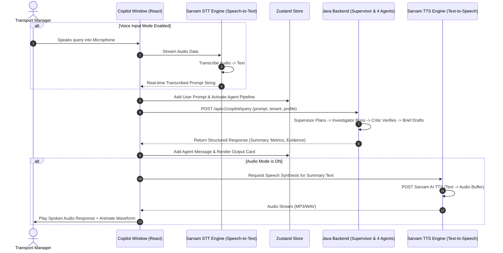

# Supervisor Voice & Chat Copilot Specification

**Version:** 1.1 | **Date:** 2026-09-05 | **Domain:** Frontend & Workflow Integration

---

## 1. Executive Summary

The **Supervisor Voice & Chat Copilot** introduces a full bi-directional voice and text interface (STT + TTS) to the Mobility Decision Copilot frontend application. Placed alongside existing windows (Dashboard, 3D Workflow, Decision Brief, Audit Trail, Scorecard), this feature enables Transport Managers and Executives to converse with the system via natural text OR hands-free bi-directional voice commands.

The Copilot acts as an intelligent Supervisor, orchestrating the backend 4-agent workflow (Supervisor → Investigator → Evidence Critic → Briefing/Action Drafting), summarizing analytical insights, and processing voice inputs via **Speech-to-Text (STT)** while generating natural spoken audio outputs via **Sarvam AI Text-to-Speech (TTS)**.

---

## 2. User Experience & Key Features

### 2.1 Speech-to-Text (STT) Voice Input
- **Voice Transcription**: User speaks into the microphone (or uses Push-to-Talk). Spoken audio is transcribed to text in real-time via **Sarvam AI STT (`speech-to-text`)** API (or native Web Speech API fallback).
- **Auto-Submission**: In Audio Mode, once speech input pauses, the transcribed prompt is automatically submitted to the Supervisor Agent.

### 2.2 Text-to-Speech (TTS) Voice Output
- **Sarvam AI Voice Synthesis**: The Supervisor's summarized response is synthesized into high-quality spoken audio using **Sarvam AI TTS (`text-to-speech`)**.
- **Audio Mode Toggle Switch**: A prominent header button (`[ 🔊 Audio Mode: ON / OFF ]`). When enabled, the system engages in seamless hands-free conversation (STT input → Agent processing → TTS audio output).
- **Visual Waveform**: Pulsing visualizer displays active speech recognition (listening state) and audio output synthesis (speaking state).

### 2.3 Supervisor Agent Execution Workflow
1. User speaks or types a query (e.g., *"Why did delays increase in pinnacle-Slc during June?"* or *"Summarize vanta-Aus punctuality and EV share"*).
2. STT transcribes spoken voice to text.
3. The Copilot passes the prompt to the Supervisor Agent.
4. The UI displays real-time agent execution pipeline badges:
   - 🔵 `Supervisor Planning` → Task allocation & worker selection
   - 🟢 `Investigator Workers` → Governed DuckDB tool executions
   - 🟡 `Critic Verification` → Deterministic factual claim checking
   - 🩷 `Briefing Summarization` → Dual-audience narrative & proposal generation
5. The output is rendered in a structured message card with text summaries, key metrics, evidence citations, and an audio playback bar.

---

## 3. Architecture & Bi-Directional Data Flow

---

## 4. Component Inventory & Code Structure

### 4.1 Frontend Files To Add/Modify

| File Path | Description |
|---|---|
| [`frontend/src/shared/Nav.tsx`](file:///Volumes/Barathan/Projects/hackathon/nextgenaicoders-moveinsync/frontend/src/shared/Nav.tsx) | Add `Supervisor Copilot` nav button (`🎙`) to `SideNav` and route handling. |
| [`frontend/src/App.tsx`](file:///Volumes/Barathan/Projects/hackathon/nextgenaicoders-moveinsync/frontend/src/App.tsx) | Add view rendering condition for `page === 'copilot'`. |
| [`frontend/src/features/copilot/SupervisorCopilotPage.tsx`](file:///Volumes/Barathan/Projects/hackathon/nextgenaicoders-moveinsync/frontend/src/features/copilot/SupervisorCopilotPage.tsx) | **[NEW]** Main Copilot window component with Chat thread, Voice mic controls, Audio Mode toggle, STT transcription preview, and Agent Pipeline status. |
| [`frontend/src/core/sarvamAudio.ts`](file:///Volumes/Barathan/Projects/hackathon/nextgenaicoders-moveinsync/frontend/src/core/sarvamAudio.ts) | **[NEW]** Speech-to-Text (STT) voice transcriber & Sarvam AI Text-to-Speech (TTS) audio synthesis manager. |
| [`frontend/src/core/store.ts`](file:///Volumes/Barathan/Projects/hackathon/nextgenaicoders-moveinsync/frontend/src/core/store.ts) | Extend Zustand store with Audio Mode state, STT listening state, TTS audio playback state, and message thread history. |
| [`frontend/src/styles.css`](file:///Volumes/Barathan/Projects/hackathon/nextgenaicoders-moveinsync/frontend/src/styles.css) | Add styling for Copilot chat thread, pulsing mic button, audio mode toggle, audio player waveform, and agent pipeline badges. |

### 4.2 Mock Data & Backend Fallback
When `VITE_USE_MOCKS=true` or offline, `sarvamAudio.ts` uses Web Speech API (`SpeechRecognition` / `webkitSpeechRecognition` for STT, `speechSynthesis` for TTS) with synthetic audio wave rendering, allowing full demo operation without requiring an active Sarvam AI API key.

---

## 5. Definition of Done

- [ ] New `🎙 Voice Copilot` navigation item added to sidebar.
- [ ] Speech-to-Text (STT) mic button captures user speech and transcribes it to text in real-time.
- [ ] Copilot window renders with header, audio mode toggle switch, conversation thread, prompt chips, and STT voice input bar.
- [ ] Real-time agent status bar displays Supervisor -> Investigator -> Critic -> Briefing execution steps.
- [ ] Agent summary is displayed as a formatted card with key metrics and evidence.
- [ ] Enabling Audio Mode automatically synthesizes and plays spoken response via Sarvam AI TTS (or Web Speech API fallback).
- [ ] Application compiles cleanly with zero TypeScript errors (`npm run build`).
