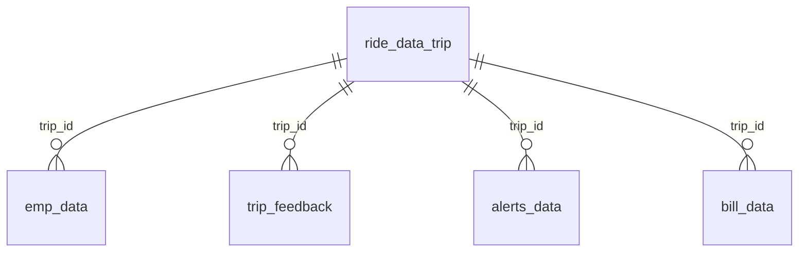

# MoveInSync Hackathon — Dataset Guide

Welcome, and good luck! This folder holds an anonymised slice of real-world
enterprise mobility data — trips, riders, vendors, alerts, bills, and feedback
across cab, nodal, and shuttle modes for **May–July 2026**. Everything you need
to build for the challenge is here.

This guide is your **start-here map**: what each file is, how they connect, and
the handful of data quirks worth knowing before you write a single join. The
per-file data dictionaries go deeper on every column.

## The five tables

| File | Grain (one row =) | Rows | Reach for it when you need… |
|---|---|---|---|
| [`ride_data_trip`](./ride_data_trip.md) (3 monthly CSVs) | one cab trip | 188,992 (May) + 210,669 (Jun) + 215,885 (Jul) | the trip spine — timing, delays, distance, vendor, compliance |
| [`emp_data`](./emp_data.md) | one employee's leg of a trip | 1,637,906 | who rode, pickups/drops, no-shows, boarding |
| [`trip_feedback`](./trip_feedback.md) | one employee's rating of a trip leg | 512,873 | route / driver / cab / safety / marshal ratings |
| [`alerts_data`](./alerts_data.md) | one alert raised on a trip | 51,699 | safety & compliance events (SOS, geofence, over-speeding…) |
| [`bill_data`](./bill_data.md) | one billed trip line item | 620,942 | cost, distance billed, vendor, contract, slab |

All five share the same five **business units**: `vanta-Aus`, `catalyst-Sac`,
`orbit-Slc`, `vanta-Sea`, `pinnacle-Slc`.

## How the tables connect

`trip_id` is the spine that runs through all five files. `stwid` (the rider id)
additionally links riders across their legs, alerts, and ratings.



- **`ride_data_trip`** is one row per trip — the natural hub.
- **`emp_data`**, **`trip_feedback`**, and **`alerts_data`** are
  many-per-trip (several riders, ratings, or alerts under one `trip_id`), and
  each also carries **`stwid`**, so you can follow a single employee across their
  legs, alerts, and feedback.
- **`bill_data`** is billing line items keyed by `trip_id` (no `stwid`).

## Read this before you join — the data quirks

This dataset is deliberately a little messy, the way real ops data is. Handling
it gracefully is explicitly rewarded, so here's the cheat sheet:

1. **`trip_id` is formatted three different ways.** Comma-formatted strings
   (`"1,097,076"`) in `ride_data_trip`, `alerts_data`, and `trip_feedback`; a
   plain numeric string (`"1123974"`) in `bill_data`; a clean `int64` in
   `emp_data`. **Normalise before joining** — strip commas and cast
   to one consistent type.

2. **`stwid` (rider id) varies too**, and `0` / `"0"` is a *placeholder*, not a
   real employee (trip-level alerts, non-rider rows). Filter it out for
   per-rider analysis.

3. **Dates come in several shapes.** ISO `YYYY-MM-DD` in
   `emp_data`; free-text `"May 1, 2026"` in `ride_data_trip`;
   free-text with a time, `"June 3, 2026, 11:00 AM"`, in `trip_feedback`; and
   `"May 1, 2026, 12:03 AM"` timestamps in `alerts_data` / `bill_data`. Parse
   per file rather than assuming one format.

4. **Epoch columns are sometimes comma-strings.** The four `*_epoch` columns in
   `ride_data_trip` are comma-formatted strings; in `emp_data`
   they're floats. Strip commas before converting.

5. **`ride_data_trip` drifts across months.** `is_driver_nc` / `is_cab_nc` are
   `bool` in June/July but `object` (with nulls) in May; `planned_km` is `float`
   in May/June but `object` in July. Reconcile dtypes if you concat the three
   months.

6. **Negative distances in `emp_data`.** `planned_km` and
   `traveled_km` dip below zero (down to `-6.63`), which is physically
   impossible — drop, clip, or flag them.

7. **A stray `"False"` in `alerts_data.severity`.** That column should only hold
   `Sev-1/2/3` (plus nulls) — the literal `"False"` is bad data.

8. **Comma-formatted numerics beyond the ids.** `trip_cost` (`bill_data`) and
   `delay_minutes` (`ride_data_trip`) are comma-formatted strings too — strip
   before doing math.

9. **Nulls are common and usually meaningful,** not errors: an unacknowledged
   alert has a null `acknowledge_time`; a boarded employee has a null
   `not_boarding_reason`; an incomplete leg has null `actual_*_epoch`. Design for
   missingness rather than dropping rows blindly.

### One-liner for normalising a join key

Whatever your stack, the rule is the same — *remove commas, cast to a single
type*. In pandas that's:

```python
df["trip_id"] = (
    df["trip_id"].astype(str).str.replace(",", "", regex=False).astype("int64")
)
```

## What you're building for

The challenge is an **agentic intelligence & reporting layer** — something that
*senses* what's happening in this data, *reasons* about what it means (against a
trend, an SLA, a benchmark, or a peer), and *acts*, for one of three personas:
the **transport manager**, the **transport & facilities head**, or the
**team / line manager**. The full brief is in the problem statement document
included in this package.

Happy hacking.
